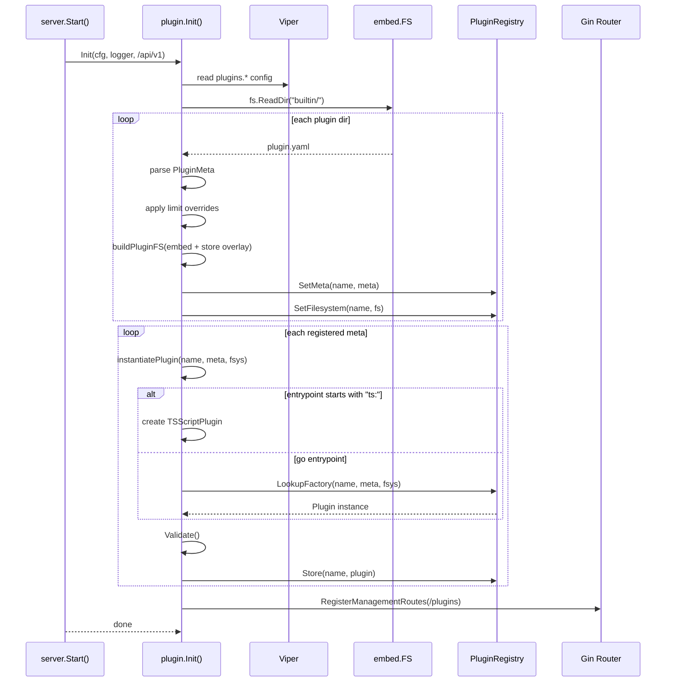
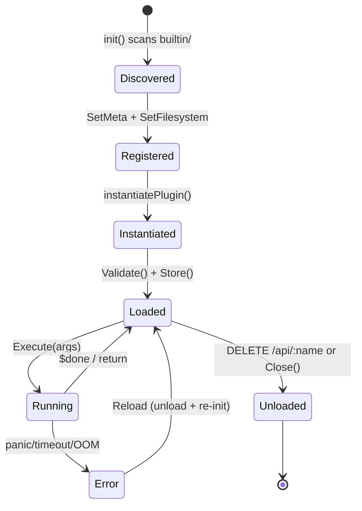
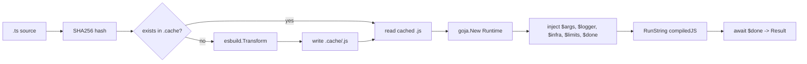

# `pkg/plugin/` — Plugin System Reference

## Overview

The plugin system allows dynamically loaded, sandboxed extensions embedded in the binary. Plugins can be pure Go types or TypeScript scripts (transpiled via **esbuild** and executed via **goja** at runtime). Built-in plugins live under `builtin/` and are embedded via `//go:embed`. Runtime overrides are stored in `store/plugins/` on disk with a CopyOnWriteFs overlay.

### Files at a glance

| File | Role |
|------|------|
| `plugin.go` | `Plugin` interface, `PluginMeta`, `ResourceLimits`, `Context`, `Result` |
| `registry.go` | `PluginRegistry` singleton — factory/meta/filesystem maps |
| `store.go` | `embed.FS` → `afero.Fs` adapter, `buildPluginFS()`, `ensureStoreDir()` |
| `sandbox.go` | Timeout enforcement, RSS memory monitor via gopsutil, panic recovery |
| `transpiler.go` | `TSCache` — SHA256 cache + esbuild TS→JS transpilation |
| `runtime.go` | `ScriptRuntime.Execute` — fresh goja VM, injected globals, script execution |
| `tsplugin.go` | `TSScriptPlugin` — generic TS-based plugin implementing the `Plugin` interface |
| `init.go` | `Init()` — entry point: config loading, builtin scanning, instantiation, route wiring |
| `gin.go` | 7 Gin REST handlers for plugin management |
| `embed.go` | `//go:embed builtin` directive |

---

## Core Types (`plugin.go`)

```go
type Plugin interface {
    Meta() PluginMeta
    Execute(ctx Context, args map[string]interface{}) (*Result, error)
    Validate() error
    Close() error
}
```

`PluginMeta` is the manifest struct loaded from `plugin.yaml`. Fields: `Name`, `Version`, `Description`, `Author`, `DependsOn`, `Entrypoint` (`"go:FuncName"` or `"ts:path/to/script.ts"`), `Limits`.

`Context` carries per-execution state: `ID`, `Logger`, `Registry` (infrastructure `ComponentRegistry`), `Cancel` func, and effective `Limits`.

`Result` is `{Success bool, Data interface{}, Error string}`.

---

## TypeScript Script Plugin (`tsplugin.go`)

When `entrypoint` starts with `ts:`, the system creates a `TSScriptPlugin` that:
1. Reads the `.ts` file from the plugin's afero filesystem
2. Compiles via `TSCache` (esbuild → SHA256 cache → `.js`)
3. Executes in a fresh goja VM with injected globals

No Go code needed for the plugin — just a `plugin.yaml` manifest and `.ts` files in `scripts/`.

### Injected globals available in TypeScript

```
$args    → Record<string, any>     (user-supplied execution arguments)
$logger  → { info, warn, error, debug }
$limits  → { max_timeout_ms, max_memory_bytes }
$infra   → { get(name): any }      (access to infrastructure.ComponentRegistry)
$done    → callback({ success, data, error })
```

Reference types at `pkg/plugin/sdk/plugin.d.ts`. Drop this file in your IDE for autocompletion.

---

## Go Plugin (`registry.go` + factory pattern)

For Go-based plugins, register a `PluginFactory` via `init()`:

```go
func init() {
    RegisterPlugin("myplugin", func(meta PluginMeta, fs afero.Fs) (Plugin, error) {
        return &MyPlugin{fs: fs}, nil
    })
}
```

The factory receives the parsed `PluginMeta` and a per-plugin afero `Fs` (embed + overlay). The plugin must implement the `Plugin` interface. **Important**: because Go packages cannot have `.go` files with the same `package` declaration in nested directories, register Go plugins from flat files directly inside `pkg/plugin/` (e.g., a file named `plugin_myplugin.go`). Subdirectories under `builtin/` hold only `plugin.yaml` + `.ts` scripts (no `.go` files).

---

## Init Flow

Called from `internal/server/server.go:105`:

```go
pluginGroup := s.gin.Group("/api/v1")
plugin.Init(s.config, s.logger, pluginGroup)
```



---

## Lifecycle States



- **Discovered**: plugin.yaml found and parsed
- **Registered**: meta + filesystem stored in registry
- **Instantiated**: Plugin instance created from factory or TSScriptPlugin
- **Loaded**: Validated and stored in `plugins` map
- **Running**: `Execute()` in progress
- **Error**: Execution failed (panic recovered, timeout, OOM)
- **Unloaded**: `Close()` called, entry removed from registry

---

## Afero Filesystem Layers (`store.go`)

Each plugin gets a layered filesystem:

```
Layer 1 (base, read-only) :  embed.FS (builtin/{name}/)
Layer 2 (overlay, writable): os.DirFS(store/plugins/{name}/ on disk)
    → Combined via afero.NewCopyOnWriteFs
    → .ts files in store/{name}/scripts/ shadow builtin versions
    → Gin PUT writes new .ts to the writable overlay
    → .cache/ is in the overlay for compiled JS artifacts
```

Directory layout per plugin:
```
store/plugins/{name}/
    scripts/      — hot-replaceable .ts files (overlay)
    .cache/       — esbuild output, keyed by SHA256(source).js
    config/       — plugin-specific config (future use)
    data/         — plugin working data (future use)
```

---

## Sandbox (`sandbox.go`)

Two guard mechanisms, both running in-goroutine:

| Mechanism | Implementation | Trigger |
|-----------|---------------|---------|
| **Timeout** | `context.WithTimeout` → cancels when exceeded | `limits.max_timeout_ms` |
| **OOM** | `gopsutil/v3/process.MemoryInfo` polling every 500ms | `limits.max_memory_bytes` RSS |

`PluginSandbox.ExecuteWithGuard` wraps both. Panics are recovered and returned as errors. Hard caps from config always override per-plugin limits.

---

## Transpilation Pipeline (`transpiler.go` + `runtime.go`)



- Cache key: `SHA256(source)`
- Cache file: `.cache/{sha256}.js` in the plugin's afero overlay
- Transpile target: es2020
- Each `Execute()` creates a fresh goja VM (no state sharing)

---

## Gin REST API (`gin.go`)

Registered at `Init()` on `/api/v1/plugins`:

| Method | Path | Handler |
|--------|------|---------|
| `GET` | `/api/v1/plugins` | List all plugins (name, version, status) |
| `GET` | `/api/v1/plugins/:name` | Plugin detail + meta + loaded status |
| `POST` | `/api/v1/plugins/:name/execute` | Execute with `{"args": {...}}` |
| `PUT` | `/api/v1/plugins/:name/scripts/:file` | Upload/replace `.ts` script (overlay) |
| `GET` | `/api/v1/plugins/:name/scripts` | List `.ts` script files |
| `GET` | `/api/v1/plugins/:name/scripts/:file` | Get `.ts` source content |
| `DELETE` | `/api/v1/plugins/:name` | `Close()` + unload from registry |

---

## Configuration (`config.yaml`)

```yaml
plugins:
  enabled: true
  default_limits:
    max_timeout_ms: 30000
    max_memory_bytes: 104857600         # 100 MB
  overrides:
    example:
      max_timeout_ms: 10000
```

Viper keys: `plugins.enabled`, `plugins.default_limits.max_timeout_ms`, `plugins.overrides.{name}.max_timeout_ms`. Overrides are applied per-plugin on top of defaults. The hard cap acts as an absolute maximum — if a plugin.yaml or override sets limits higher, they are clamped.

---

## Adding a New Plugin

### TypeScript plugin (recommended for dynamic logic)

1. Create `pkg/plugin/builtin/{name}/plugin.yaml`:
   ```yaml
   name: myplugin
   version: 1.0.0
   description: My plugin
   entrypoint: "ts:scripts/handler.ts"
   limits:
     max_timeout_ms: 5000
     max_memory_bytes: 26214400
   ```
2. Create `pkg/plugin/builtin/{name}/scripts/handler.ts` using `$args`, `$logger`, `$done`.
3. Optionally add `pkg/plugin/sdk/plugin.d.ts` to your project for IDE support.

### Go plugin (when native performance or infra access is needed)

1. Create `pkg/plugin/plugin_{name}.go` (flat file in `pkg/plugin/`):
   - Implement `Plugin` interface
   - Register via `init()`: `RegisterPlugin("name", factory)`
2. Create `pkg/plugin/builtin/{name}/plugin.yaml` with `entrypoint: "go:MyFunc"`.
3. (Optional) Create `pkg/plugin/builtin/{name}/structs.go` for config types.

### Both approaches

- The plugin is auto-discovered at startup via `//go:embed builtin`
- Runtime script overrides can be uploaded via `PUT /api/v1/plugins/:name/scripts/:file`
- Config overrides can be set in `config.yaml` → `plugins.overrides`

---

## Key Constraints & Gotchas

- **No `.go` files in `builtin/` subdirectories**: Go requires all `.go` files with the same `package` declaration to be in the same directory. Nesting `.go` files under `builtin/{name}/` with `package plugin` does not compile. Place Go plugin registration in flat files within `pkg/plugin/` directly (e.g., `pkg/plugin/plugin_myplugin.go`).
- **Cache directory**: The `.cache/` dir lives in the *overlay* filesystem (`store/plugins/{name}/.cache/`), not in the embed. On first run, all `.ts` files are transpiled and cached. If the overlay is deleted, caches are rebuilt.
- **Fresh VM per call**: `goja.Runtime` is created for every `Execute()` call. No JS state persists between executions.
- **Global loggers/registry**: `plugin.Init()` stores `globalLogger` and `globalInfraRegistry` as package vars accessed by Gin handlers. These are set at boot and must not be nil when handlers fire.
- **Plugin order**: `plugin.Init()` is called *after* middleware and services boot in `server.go`. Infrastructure components are initialized asynchronously and may not be available when a plugin's `Execute()` first runs — the plugin developer should handle this.
- **No plugin hot-reload yet**: `DELETE + re-registration` is manual via the API. A file watcher for the overlay directory is future work.
- **Embed path**: The `//go:embed builtin` directive in `embed.go` embeds the entire `builtin/` directory tree. The `builtinFS` variable must use the `embed` package type and is set via `SetBuiltinFS()` in an `init()` function in the same file.
