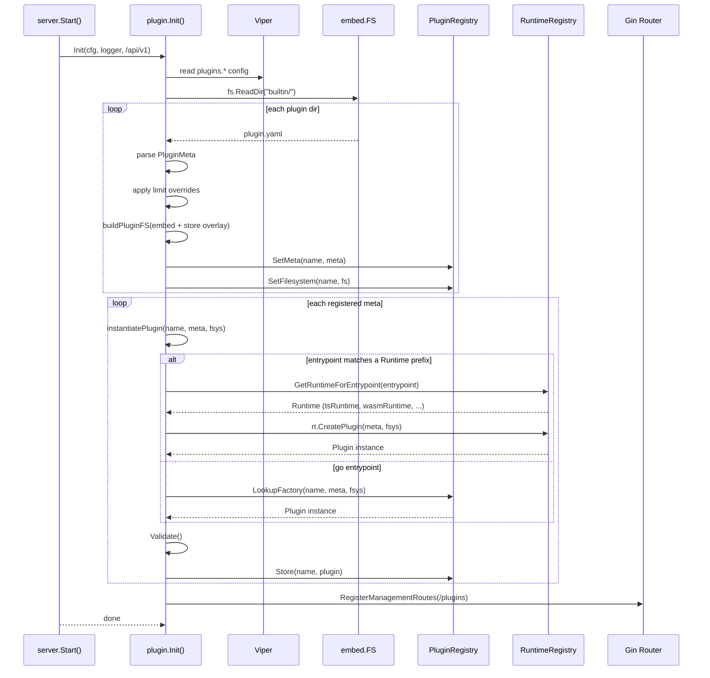
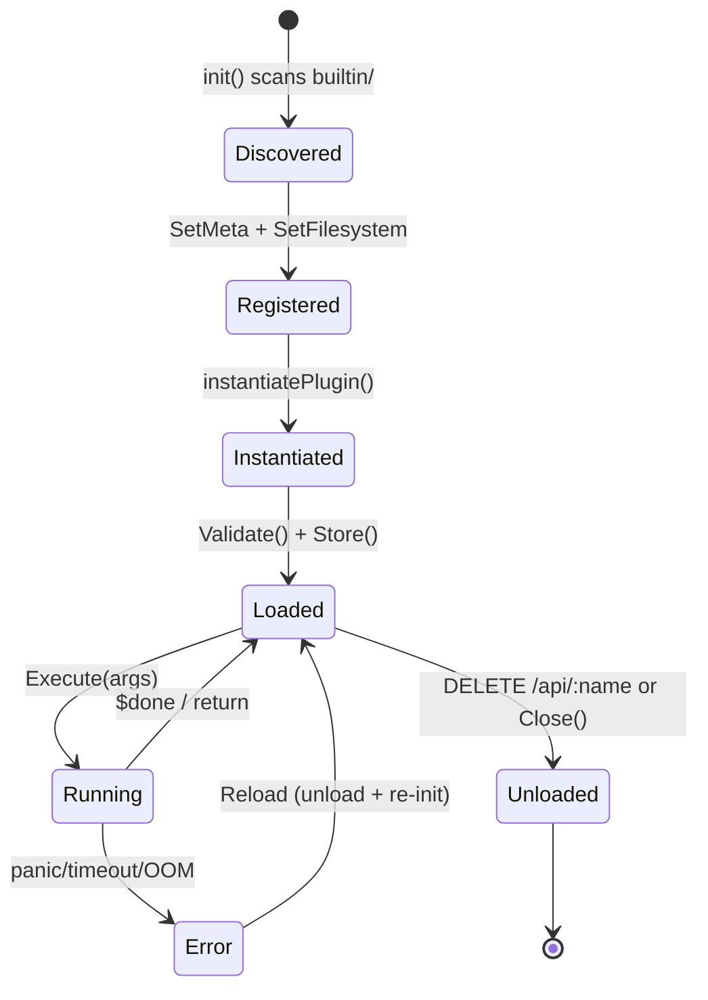
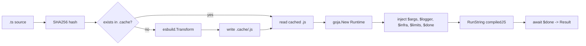

# `pkg/plugin/` — Plugin System Reference

## Overview

The plugin system allows dynamically loaded, sandboxed extensions embedded in the binary. Plugins can be pure Go types, TypeScript scripts (transpiled via **esbuild** and executed via **goja** at runtime), or **WebAssembly** modules (executed via **wazero**). Built-in plugins live under `builtin/` and are embedded via `//go:embed`. Runtime overrides are stored in `store/plugins/` on disk with a CopyOnWriteFs overlay.

### Files at a glance

| File | Role |
|------|------|
| `plugin.go` | `Plugin` interface, `Runtime` interface, `PluginMeta`, `ResourceLimits`, `Context`, `Result` |
| `registry.go` | `PluginRegistry` singleton — factory/meta/filesystem maps |
| `store.go` | `embed.FS` → `afero.Fs` adapter, `buildPluginFS()`, `ensureStoreDir()` |
| `sandbox.go` | Timeout enforcement, RSS memory monitor via gopsutil, panic recovery |
| `transpiler.go` | `TSCache` — SHA256 cache + esbuild TS→JS transpilation |
| `runtime.go` | `ScriptRuntime.Execute` — fresh goja VM, injected globals, script execution |
| `runtime_registry.go` | `Runtime` registry — prefix-based lookup for plugin execution engines |
| `tsplugin.go` | `TSScriptPlugin` + `tsRuntime` — TS-based plugin implementing `Runtime` for `ts:` prefix |
| `wasm.go` | `WASMPlugin` + `wasmRuntime` — wazero-based WebAssembly runtime for `wasm:` prefix |
| `bridge.go` | `PluginBridge` — `InfrastructureComponent` so services/infra can call plugins |
| `init.go` | `Init()` — entry point: config loading, builtin scanning, instantiation, route wiring |
| `gin.go` | 7 Gin REST handlers for plugin management |
| `embed.go` | `//go:embed builtin` directive |

---

## Core Types (`plugin.go`)

```go
type Plugin interface {
    Meta() PluginMeta
    Execute(ctx Context, args map[string]interface{}) (*Result, error)
    Validate() error
    Close() error
}
```

`PluginMeta` is the manifest struct loaded from `plugin.yaml`. Fields: `Name`, `Version`, `Description`, `Author`, `DependsOn`, `Entrypoint` (`"go:FuncName"`, `"ts:path/to/script.ts"`, or `"wasm:path/to/module.wasm"`), `Limits`.

`Context` carries per-execution state: `ID`, `Logger`, `Registry` (infrastructure `ComponentRegistry`), `Cancel` func, and effective `Limits`.

`Result` is `{Success bool, Data interface{}, Error string}`.

---

## TypeScript Script Plugin (`tsplugin.go`)

When `entrypoint` starts with `ts:`, the system creates a `TSScriptPlugin` that:
1. Reads the `.ts` file from the plugin's afero filesystem
2. Compiles via `TSCache` (esbuild → SHA256 cache → `.js`)
3. Executes in a fresh goja VM with injected globals

No Go code needed for the plugin — just a `plugin.yaml` manifest and `.ts` files in `scripts/`.

Entrypoints: `"ts:scripts/handler.ts"` — the `tsRuntime` (registered in `tsplugin.go`) strips the `ts:` prefix and creates a `TSScriptPlugin`.

### Injected globals available in TypeScript

```
$args    → Record<string, any>     (user-supplied execution arguments)
$logger  → { info, warn, error, debug }
$limits  → { max_timeout_ms, max_memory_bytes }
$infra   → { get(name): any }      (access to infrastructure.ComponentRegistry)
$done    → callback({ success, data, error })
```

Reference types at `pkg/plugin/sdk/plugin.d.ts`. Drop this file in your IDE for autocompletion.

---

## WebAssembly Plugin (`wasm.go`)

When `entrypoint` starts with `wasm:`, the system creates a `WASMPlugin` that:
1. Reads the `.wasm` binary from the plugin's afero filesystem
2. Instantiates it in a **wazero** runtime with WASI snapshot preview1 support
3. Injects two host functions (`host_log`, `host_infra_get`) so the WASM module can log and query infrastructure
4. Calls the module's exported `execute(i32, i32) → i32` function

### Host ABI

| Host function | Signature | Description |
|---------------|-----------|-------------|
| `host_log` | `(level: i32, msgPtr: i32, msgLen: i32) → ()` | Log a string at the given level (0=debug, 1=info, 2=warn, 3+=error) |
| `host_infra_get` | `(namePtr: i32, nameLen: i32, outPtr: i32, outMax: i32) → i32` | Get component status JSON, writes to output buffer, returns bytes written (0 if not found) |

### WASM module contract

Every WASM plugin must export:
- **`memory`** — linear memory (at least 1 page / 64 KB)
- **`execute(inputPtr: i32, inputLen: i32) → i32`** — entry point. Input args JSON is written at `inputPtr`. Returns the offset in memory where the JSON `Result` is written (`readWASMMemoryToEnd` reads until the end of memory from that offset).

### Example WASM plugin

See `pkg/plugin/builtin/wasm_greeter_plugin/` for a complete example. The WAT source is at `scripts/handler.wat`; compile it with:

```bash
wat2wasm scripts/handler.wat -o scripts/handler.wasm
```

A `//go:generate` directive in `wasm.go` automates this:

```bash
go generate ./pkg/plugin/
```

Entrypoints: `"wasm:scripts/handler.wasm"` — the `wasmRuntime` (registered in `wasm.go`) strips the `wasm:` prefix and creates a `WASMPlugin`.

---

## Runtime Registry (`runtime_registry.go`)

The `Runtime` interface is the extension point for adding new plugin execution engines:

```go
type Runtime interface {
    Prefix() string                           // unique prefix like "ts:", "wasm:"
    CreatePlugin(meta PluginMeta, fs afero.Fs) (Plugin, error)
}
```

Runtimes self-register via `init()`:

```go
func init() { RegisterRuntime(&wasmRuntime{}) }
```

`instantiatePlugin()` in `init.go` now delegates to `GetRuntimeForEntrypoint(entrypoint)` instead of hardcoding TS logic. If no runtime matches, it falls back to the Go factory pattern.

---

## Go Plugin (`registry.go` + factory pattern)

For Go-based plugins, register a `PluginFactory` via `init()`:

```go
func init() {
    RegisterPlugin("myplugin", func(meta PluginMeta, fs afero.Fs) (Plugin, error) {
        return &MyPlugin{fs: fs}, nil
    })
}
```

The factory receives the parsed `PluginMeta` and a per-plugin afero `Fs` (embed + overlay). The plugin must implement the `Plugin` interface. **Important**: because Go packages cannot have `.go` files with the same `package` declaration in nested directories, register Go plugins from flat files directly inside `pkg/plugin/` (e.g., a file named `plugin_myplugin.go`). Subdirectories under `builtin/` hold only `plugin.yaml` + `.ts` scripts (no `.go` files).

---

## Init Flow

Called from `internal/server/server.go:105`:

```go
pluginGroup := s.gin.Group("/api/v1")
plugin.Init(s.config, s.logger, pluginGroup)
```



---

## Lifecycle States



- **Discovered**: plugin.yaml found and parsed
- **Registered**: meta + filesystem stored in registry
- **Instantiated**: Plugin instance created from factory or TSScriptPlugin
- **Loaded**: Validated and stored in `plugins` map
- **Running**: `Execute()` in progress
- **Error**: Execution failed (panic recovered, timeout, OOM)
- **Unloaded**: `Close()` called, entry removed from registry

---

## Afero Filesystem Layers (`store.go`)

Each plugin gets a layered filesystem:

```
Layer 1 (base, read-only) :  embed.FS (builtin/{name}/)
Layer 2 (overlay, writable): os.DirFS(store/plugins/{name}/ on disk)
    → Combined via afero.NewCopyOnWriteFs
    → .ts files in store/{name}/scripts/ shadow builtin versions
    → Gin PUT writes new .ts to the writable overlay
    → .cache/ is in the overlay for compiled JS artifacts
```

Directory layout per plugin:
```
store/plugins/{name}/
    scripts/      — hot-replaceable .ts files (overlay)
    .cache/       — esbuild output, keyed by SHA256(source).js
    config/       — plugin-specific config (future use)
    data/         — plugin working data (future use)
```

---

## Sandbox (`sandbox.go`)

Two guard mechanisms, both running in-goroutine:

| Mechanism | Implementation | Trigger |
|-----------|---------------|---------|
| **Timeout** | `context.WithTimeout` → cancels when exceeded | `limits.max_timeout_ms` |
| **OOM** | `gopsutil/v3/process.MemoryInfo` polling every 500ms | `limits.max_memory_bytes` RSS |

`PluginSandbox.ExecuteWithGuard` wraps both. Panics are recovered and returned as errors. Hard caps from config always override per-plugin limits.

---

## Transpilation Pipeline (`transpiler.go` + `runtime.go`)



- Cache key: `SHA256(source)`
- Cache file: `.cache/{sha256}.js` in the plugin's afero overlay
- Transpile target: es2020
- Each `Execute()` creates a fresh goja VM (no state sharing)

---

## Gin REST API (`gin.go`)

Registered at `Init()` on `/api/v1/plugins`.  
All examples target the built-in `inspector` plugin on `localhost:8080`.

### `GET /api/v1/plugins` — List all plugins

```bash
curl -s http://localhost:8080/api/v1/plugins | jq
```

```json
{
  "plugins": [
    {
      "name": "inspector",
      "version": "1.0.0",
      "description": "Queries all active infrastructure components ...",
      "status": "loaded"
    }
  ]
}
```

---

### `GET /api/v1/plugins/:name` — Plugin detail

```bash
curl -s http://localhost:8080/api/v1/plugins/inspector | jq
```

```json
{
  "name": "inspector",
  "version": "1.0.0",
  "description": "Queries all active infrastructure components ...",
  "author": "stackyrd",
  "entrypoint": "ts:scripts/handler.ts",
  "type": "typescript",
  "depends_on": [],
  "limits": {
    "max_timeout_ms": 15000,
    "max_memory_bytes": 33554432
  },
  "status": "loaded"
}
```

---

### `POST /api/v1/plugins/:name/execute` — Execute a plugin

**Aggregator plugin** — full-featured demo with 4 modes:

Dashboard mode (default) — inspect all components with latency:

```bash
curl -s -X POST http://localhost:8080/api/v1/plugins/aggregator/execute \
  -H 'Content-Type: application/json' \
  -d '{"args": {"mode": "dashboard"}}' | jq
```

```json
{
  "success": true,
  "data": {
    "mode": "dashboard",
    "runtime": { "elapsed_ms": 8, "limits": { "max_timeout_ms": 20000, "max_memory_bytes": 67108864 } },
    "summary": { "total": 7, "healthy": 1, "degraded": 1, "down": 5 },
    "components": [
      { "name": "redis", "available": true, "status": { "connected": true }, "latency_ms": 1, "error": null },
      { "name": "postgres", "available": true, "status": { "connected": true }, "latency_ms": 3, "error": "GetStatus failed: ..." },
      { "name": "kafka", "available": false, "status": null, "latency_ms": null, "error": null }
    ]
  }
}
```

Query mode — run a command against a single component:

```bash
curl -s -X POST http://localhost:8080/api/v1/plugins/aggregator/execute \
  -H 'Content-Type: application/json' \
  -d '{"args": {"mode": "query", "component": "redis", "command": "status"}}' | jq
```

Transform mode — apply string operations to fields:

```bash
curl -s -X POST http://localhost:8080/api/v1/plugins/aggregator/execute \
  -H 'Content-Type: application/json' \
  -d '{
    "args": {
      "mode": "transform",
      "input": { "name": "  hello world  ", "role": "admin" },
      "rules": [
        { "field": "name", "operation": "uppercase" },
        { "field": "name", "operation": "trim" },
        { "field": "role", "operation": "prefix", "value": "role_" }
      ]
    }
  }' | jq
```

```json
{
  "success": true,
  "data": {
    "mode": "transform",
    "runtime": { "elapsed_ms": 1, "limits": { "max_timeout_ms": 20000, "max_memory_bytes": 67108864 } },
    "original": { "name": "  hello world  ", "role": "admin" },
    "transformed": { "name": "  HELLO WORLD  ", "role": "role_admin" },
    "applied_rules": 3
  }
}
```

Echo mode — connectivity test:

```bash
curl -s -X POST http://localhost:8080/api/v1/plugins/aggregator/execute \
  -H 'Content-Type: application/json' \
  -d '{"args": {"mode": "echo", "custom_field": "test"}}' | jq
```

**Inspector plugin** — lightweight infra ping:

```bash
curl -s -X POST http://localhost:8080/api/v1/plugins/inspector/execute \
  -H 'Content-Type: application/json' \
  -d '{"args": {"mode": "ping"}}' | jq
```

Status-mode with specific components:

```bash
curl -s -X POST http://localhost:8080/api/v1/plugins/inspector/execute \
  -H 'Content-Type: application/json' \
  -d '{"args": {"mode": "status", "components": ["redis", "postgres"]}}' | jq
```

Response shape:

```json
{
  "success": true,
  "data": {
    "elapsed_ms": 12,
    "mode": "ping",
    "summary": { "total": 7, "available": 2, "unavailable": 5 },
    "components": [
      {
        "name": "redis",
        "available": true,
        "status": {
          "name": "Redis",
          "connected": true,
          "pool_size": 10,
          "uptime": "5m"
        },
        "error": null
      }
    ],
    "limits": { "max_timeout_ms": 15000, "max_memory_bytes": 33554432 }
  }
}
```

---

### `PUT /api/v1/plugins/:name/scripts/:file` — Upload/replace a script

```bash
curl -s -X PUT http://localhost:8080/api/v1/plugins/inspector/scripts/handler.ts \
  -H 'Content-Type: application/json' \
  -d '{"content": "function handler() { $done({success: true, data: {msg: \"hello\"}}); } handler();"}' | jq
```

```json
{
  "message": "script uploaded",
  "path": "scripts/handler.ts"
}
```

The file is written to the on-disk overlay (`store/plugins/inspector/scripts/handler.ts`), shadowing the built-in version. The next `execute` call will transpile the new source.

---

### `GET /api/v1/plugins/:name/scripts` — List scripts

```bash
curl -s http://localhost:8080/api/v1/plugins/inspector/scripts | jq
```

```json
{
  "scripts": ["handler.ts"]
}
```

---

### `GET /api/v1/plugins/:name/scripts/:file` — Get script source

```bash
curl -s http://localhost:8080/api/v1/plugins/inspector/scripts/handler.ts | jq
```

```json
{
  "name": "handler.ts",
  "content": "function handler(): void {\n    const input = $args.input || \"world\";\n    ...\n}"
}
```

---

### `DELETE /api/v1/plugins/:name` — Unload a plugin

```bash
curl -s -X DELETE http://localhost:8080/api/v1/plugins/inspector | jq
```

```json
{
  "message": "plugin unloaded",
  "name": "inspector"
}
```

After unloading, the plugin is removed from the registry. It will be re-discovered on next app restart (or programmatic re-init).

---

## Configuration (`config.yaml`)

```yaml
plugins:
  enabled: true
  default_limits:
    max_timeout_ms: 30000
    max_memory_bytes: 104857600         # 100 MB
  overrides:
    example:
      max_timeout_ms: 10000
```

Viper keys: `plugins.enabled`, `plugins.default_limits.max_timeout_ms`, `plugins.overrides.{name}.max_timeout_ms`. Overrides are applied per-plugin on top of defaults. The hard cap acts as an absolute maximum — if a plugin.yaml or override sets limits higher, they are clamped.

---

## Adding a New Plugin

### TypeScript plugin (recommended for dynamic logic)

1. Create `pkg/plugin/builtin/{name}/plugin.yaml`:
   ```yaml
   name: myplugin
   version: 1.0.0
   description: My plugin
   entrypoint: "ts:scripts/handler.ts"
   limits:
     max_timeout_ms: 5000
     max_memory_bytes: 26214400
   ```
2. Create `pkg/plugin/builtin/{name}/scripts/handler.ts` using `$args`, `$logger`, `$done`.
3. Optionally add `pkg/plugin/sdk/plugin.d.ts` to your project for IDE support.

### WASM plugin (when cross-language portability or sandbox isolation is needed)

1. Write a `.wat` file (or compile from C/Rust/TinyGo) that exports `memory` and `execute(i32, i32) → i32`.
2. Compile to `.wasm`:
   ```bash
   wat2wasm scripts/handler.wat -o scripts/handler.wasm
   ```
3. Create `pkg/plugin/builtin/{name}/plugin.yaml`:
   ```yaml
   name: mywasmplugin
   version: 1.0.0
   description: My WASM plugin
   entrypoint: "wasm:scripts/handler.wasm"
   limits:
     max_timeout_ms: 10000
     max_memory_bytes: 52428800
   ```
4. Add `//go:generate` in a Go file to automate WAT→WASM recompilation:
   ```go
   //go:generate wat2wasm builtin/{name}/scripts/handler.wat -o builtin/{name}/scripts/handler.wasm
   ```

### Go plugin (when native performance or infra access is needed)

1. Create `pkg/plugin/plugin_{name}.go` (flat file in `pkg/plugin/`):
   - Implement `Plugin` interface
   - Register via `init()`: `RegisterPlugin("name", factory)`
2. Create `pkg/plugin/builtin/{name}/plugin.yaml` with `entrypoint: "go:MyFunc"`.
3. (Optional) Create `pkg/plugin/builtin/{name}/structs.go` for config types.

### All approaches

- The plugin is auto-discovered at startup via `//go:embed builtin`
- Runtime script overrides can be uploaded via `PUT /api/v1/plugins/:name/scripts/:file`
- Config overrides can be set in `config.yaml` → `plugins.overrides`

---

## Key Constraints & Gotchas

- **No `.go` files in `builtin/` subdirectories**: Go requires all `.go` files with the same `package` declaration to be in the same directory. Nesting `.go` files under `builtin/{name}/` with `package plugin` does not compile. Place Go plugin registration in flat files within `pkg/plugin/` directly (e.g., `pkg/plugin/plugin_myplugin.go`).
- **Cache directory**: The `.cache/` dir lives in the *overlay* filesystem (`store/plugins/{name}/.cache/`), not in the embed. On first run, all `.ts` files are transpiled and cached. If the overlay is deleted, caches are rebuilt.
- **Fresh VM per call**: `goja.Runtime` is created for every `Execute()` call. No JS state persists between executions.
- **Fresh wazero Runtime per call**: `wazero.NewRuntime` is created for every WASM `Execute()` call. Module instances are not shared between executions.
- **Global loggers/registry**: `plugin.Init()` stores `globalLogger` and `globalInfraRegistry` as package vars accessed by Gin handlers. These are set at boot and must not be nil when handlers fire.
- **Plugin order**: `plugin.Init()` runs *before* `AutoDiscoverServices` in `server.go`, so the `PluginBridge` is available in service `Dependencies` at construction time.
- **Infra readiness**: Infrastructure components are initialized asynchronously and may not be fully ready when a plugin's `Execute()` first runs — the plugin developer should handle this gracefully (the `inspector` plugin already does: it sets `available: false` for components that return nil).
- **No plugin hot-reload yet**: `DELETE + re-registration` is manual via the API. A file watcher for the overlay directory is future work.
- **Embed path**: The `//go:embed builtin` directive in `embed.go` embeds the entire `builtin/` directory tree. The `builtinFS` variable must use the `embed` package type and is set via `SetBuiltinFS()` in an `init()` function in the same file.
- **Runtime prefixes must be unique**: Two runtimes cannot share the same prefix (e.g., only one `"ts:"` runtime). The `RegisterRuntime` function panics on duplicate prefix registration.
- **WASM only supports numeric types**: WASM host function ABI is limited to `i32`, `i64`, `f32`, `f64`. Strings and compound data must be marshaled through linear memory via pointer+length pairs. The `wasm.go` helpers `readWASMMemory` and `writeWASMMemory` handle this transparently.
- **`go:generate` for WAT files**: If WAT source is modified, run `go generate ./pkg/plugin/` to recompile the `.wasm` binary before building. The compiled `.wasm` is committed to the repo so CI does not require `wat2wasm`.
