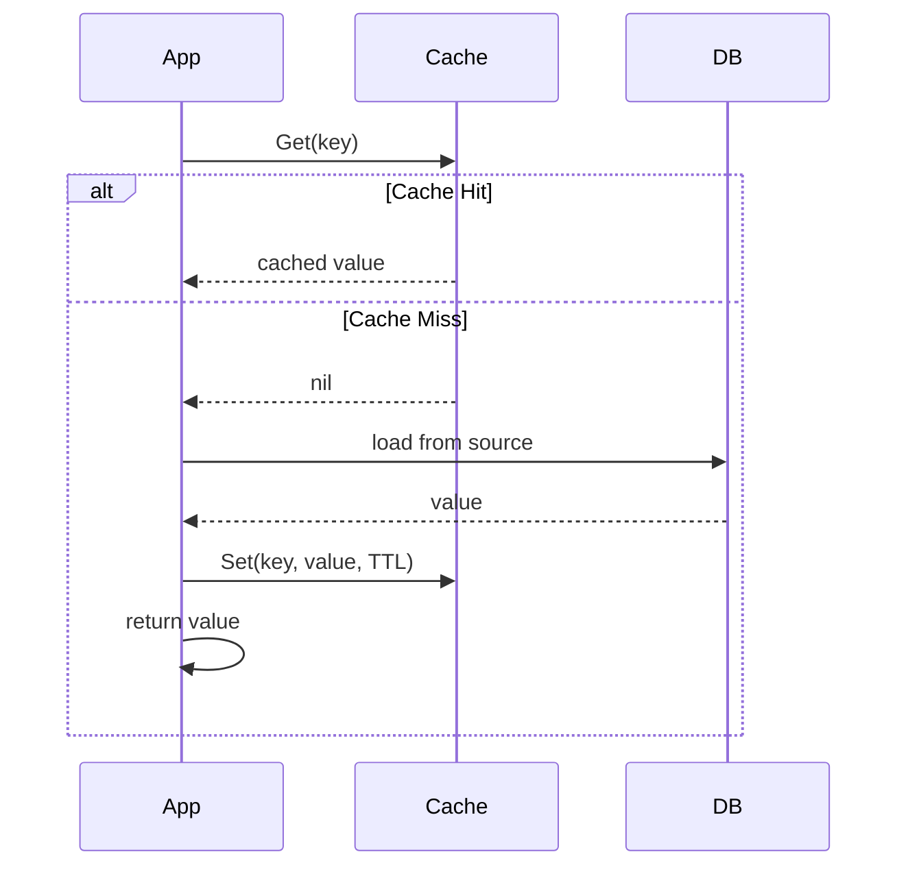

# Caching

Redis-backed cache abstraction with TTL support, cache-aside pattern, and batch invalidation.

## Overview

The `pkg/caching/` package provides a `CachingManager` that wraps the go-redis client with common caching patterns:

| Pattern | Method | Description |
|---------|--------|-------------|
| Cache-Aside | `GetOrSet` | Check cache first, fall back to loader, populate cache |
| Direct Access | `Get` / `Set` | Raw Redis get/set with TTL |
| Batch Invalidation | `InvalidatePattern` | Delete all keys matching a glob pattern |
| Bulk Operations | `MGet` / `MSet` / `MDel` | Multi-key read/write/delete |

## Configuration

```yaml
caching:
  default_ttl: 5m
  max_retries: 3
  retry_delay: 50ms
```

The config key is `caching`, mapped via `viper`:

```go
type CachingConfig struct {
    DefaultTTL  time.Duration `mapstructure:"default_ttl"`
    MaxRetries  int           `mapstructure:"max_retries"`
    RetryDelay  time.Duration `mapstructure:"retry_delay"`
}
```

## CachingManager

The `CachingManager` wraps go-redis and is initialized with the `redis` infrastructure component.

### Initialization

```go
import "stackyrd/pkg/caching"

manager, err := caching.NewCachingManager(
    redisClient,         // *redis.Client from the redis infra component
    caching.DefaultConfig(),
)
```

### Cache-Aside (GetOrSet)

The canonical read pattern — check cache, load on miss, populate cache:

```go
user, err := caching.GetOrSet(ctx, manager, "user:42", func() (interface{}, error) {
    return db.GetUser(42) // slow path
}, 5*time.Minute)
```

### Direct Get/Set

```go
// Set with TTL
err := manager.Set(ctx, "key", value, 5*time.Minute)

// Get
val, err := manager.Get(ctx, "key")

// Delete
err := manager.Del(ctx, "key")
```

### Batch Invalidation

Invalidate all keys matching a glob pattern (e.g., when a related entity is updated):

```go
// Invalidate all user cache entries
err := manager.InvalidatePattern(ctx, "user:*")

// Invalidate multiple specific keys
err := manager.InvalidatePattern(ctx, "session:*", "rate_limit:*")
```

### Bulk Operations

```go
// Multi-get
values, err := manager.MGet(ctx, "key1", "key2", "key3")

// Multi-set with TTL
err := manager.MSet(ctx, map[string]interface{}{
    "key1": val1,
    "key2": val2,
}, 5*time.Minute)

// Multi-delete
err := manager.MDel(ctx, "key1", "key2", "key3")
```

## Cache-Aside Pattern

The cache-aside (lazy loading) pattern is the recommended strategy:



### Custom Loader with Tags

```go
type UserCache struct {
    manager *caching.CachingManager
}

func (c *UserCache) GetUser(ctx context.Context, id int) (*User, error) {
    return caching.GetOrSet(ctx, c.manager, fmt.Sprintf("user:%d", id),
        func() (interface{}, error) {
            return c.repository.FindByID(id)
        },
        10*time.Minute,
    )
}

func (c *UserCache) InvalidateUser(ctx context.Context, id int) error {
    return c.manager.Del(ctx, fmt.Sprintf("user:%d", id))
}

func (c *UserCache) InvalidateAll(ctx context.Context) error {
    return c.manager.InvalidatePattern(ctx, "user:*")
}
```

## Service Integration

Services access the `CachingManager` via the `Dependencies` bag:

```go
type MyService struct {
    cache *caching.CachingManager
}

func NewMyService(enabled bool, logger *logger.Logger, deps *registry.Dependencies) interfaces.Service {
    var cache *caching.CachingManager
    if c, ok := deps.Get("caching"); ok {
        cache, _ = c.(*caching.CachingManager)
    }
    return &MyService{cache: cache}
}
```

## Best Practices

- **Always set TTL** — never cache indefinitely; choose TTL based on data staleness tolerance
- **Use cache-aside** — prefer `GetOrSet` over manual get/set for read-heavy paths
- **Batch invalidate on writes** — when an entity is updated, invalidate its cache group (e.g., `user:*`)
- **Key naming convention** — use `entity:id` or `entity:field:id` namespacing for easy pattern invalidation
- **Don't cache sensitive data** — avoid caching PII, secrets, or tokens
- **Monitor hit rate** — low hit rates suggest TTL is too short or keys are poorly named
- **Graceful degradation** — cache failures should not block the request; log and fall through to source
