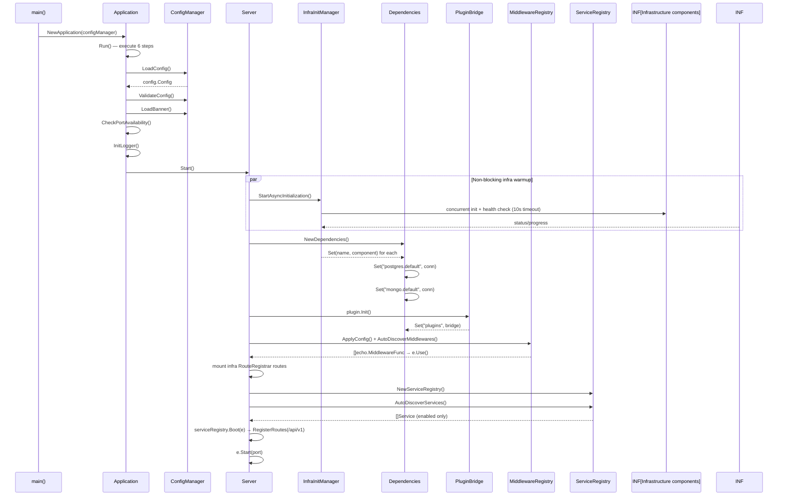
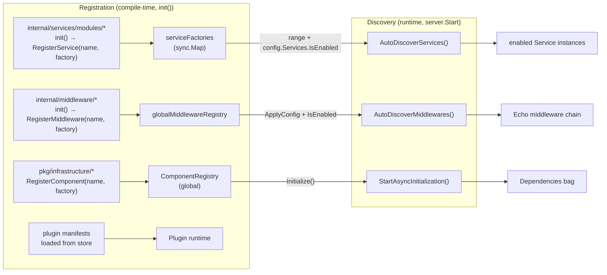
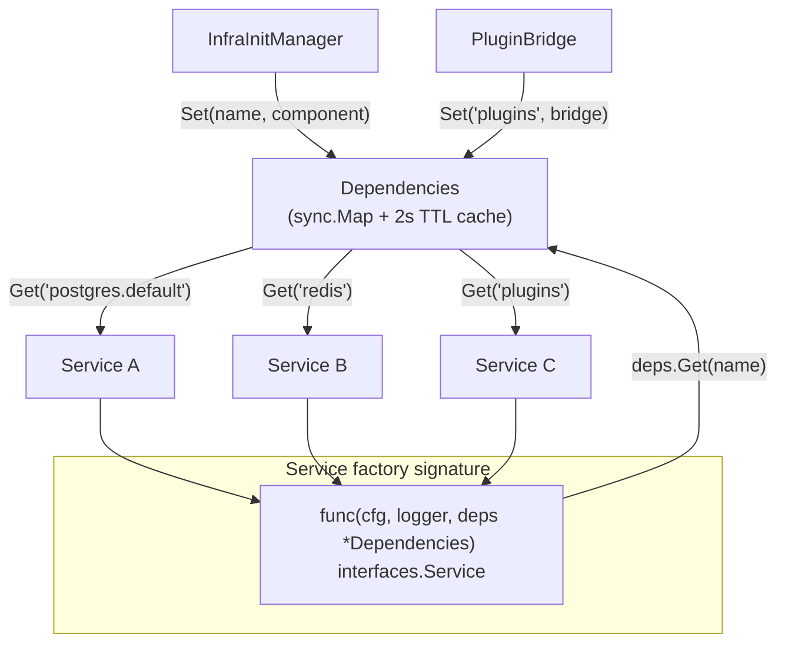
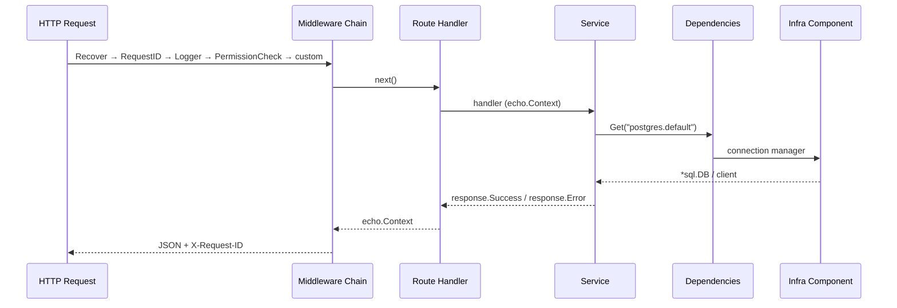
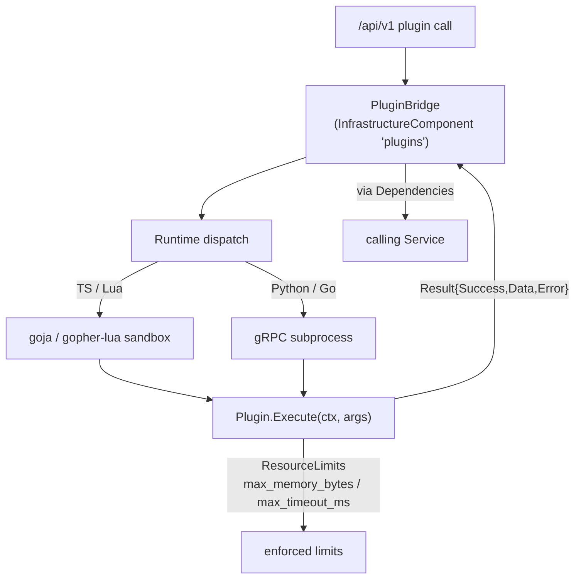
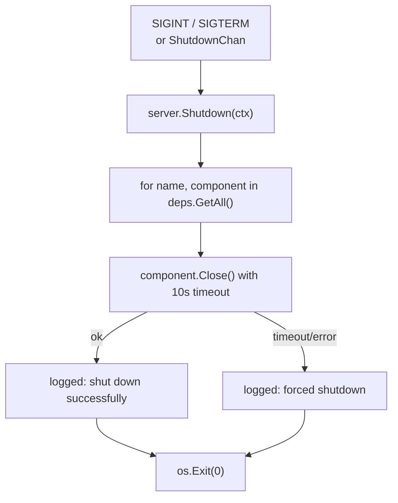
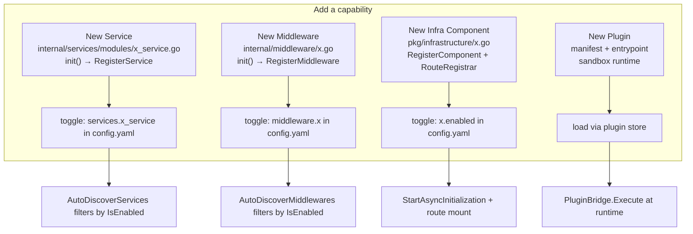
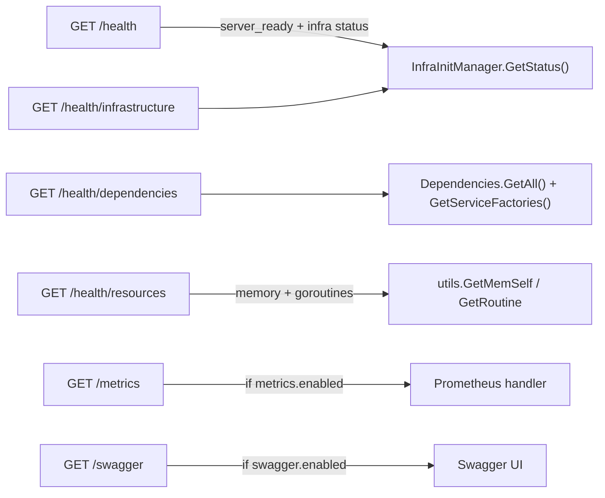

# stackyrd — Workflow Design

Modular service framework on Echo v4. Registration-based, `init()` auto-discovery,
Viper config, async infrastructure init, dependency-injection bag, sandboxed plugin runtime.

All workflows below are expressed as diagrams. Code references point at the implementing file.

---

## 1. System Context

```mermaid
flowchart TB
    CLI["CLI / Config URL<br/>(flags: -c -port -env -verbose)"] --> CM["ConfigManager<br/>(cmd/app/config_manager.go)"]
    CM -->|"config.yaml + env"| CFG["config.Config<br/>(config/config.go)"]
    CFG --> APP["Application.Run<br/>(cmd/app/application.go)"]
    APP --> SRV["server.Start<br/>(internal/server/server.go)"]

    subgraph RUNTIME["Echo HTTP Server
        SRV --> INF["Infrastructure Layer<br/>(pkg/infrastructure/*)"]
        SRV --> PLG["Plugin Runtime<br/>(pkg/plugin/*)"]
        SRV --> MW["Middleware Chain<br/>(internal/middleware/*)"]
        SRV --> SVC["Service Registry<br/>(pkg/registry/*)"]
    end

    INF --> EXT["Redis · Postgres · Mongo · Kafka · MinIO · Grafana · Cron"]
    SVC --> API["/api/v1/* routes"]
    SRV --> HC["/health · /health/infrastructure<br/>/health/dependencies · /health/resources"]
```

---

## 2. Startup Workflow (Boot Sequence)



---

## 3. Registration & Auto-Discovery



**Enable rule:** `ServicesConfig.IsEnabled(name)` defaults to **true** when unset (config/config.go:25). Middleware defaults to enabled unless `middleware.{name}` is false.

---

## 4. Dependency Injection Flow



`GetTyped[T]` provides type-safe retrieval. `GetAll()` returns a TTL-cached snapshot (2s) to avoid per-request map copies on `/health/dependencies`.

---

## 5. Request Lifecycle



**Service contract** (`pkg/interfaces/service.go`):
`Name() · WireName() · Enabled() · Endpoints() · RegisterRoutes(g *echo.Group) · Get()`

---

## 6. Plugin Execution



Plugins access infrastructure through `Context.Registry (*ComponentRegistry)` and `Context.Limits`.

---

## 7. Graceful Shutdown



---

## 8. Extension Points



**Naming:** `{name}_service.go` · `{name}.go` (infra) · `{package}_test.go`

---

## 9. Health & Observability Surface


