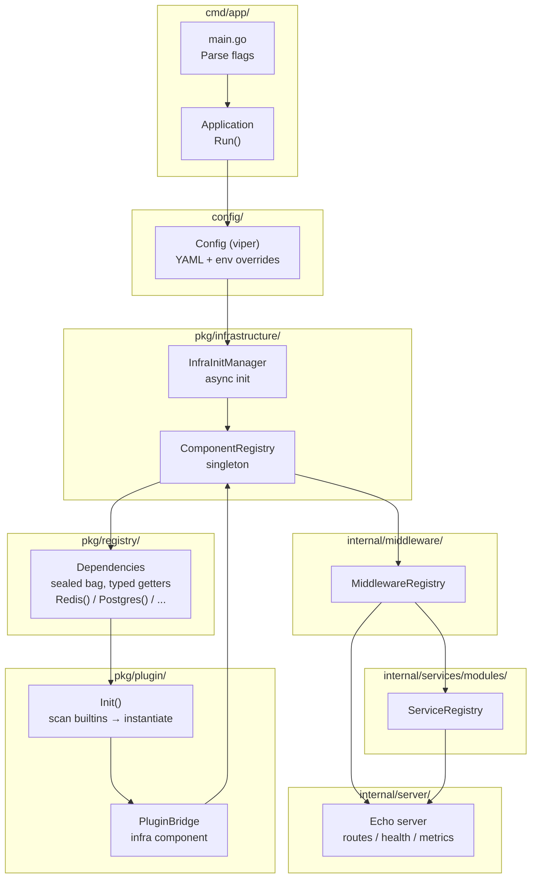
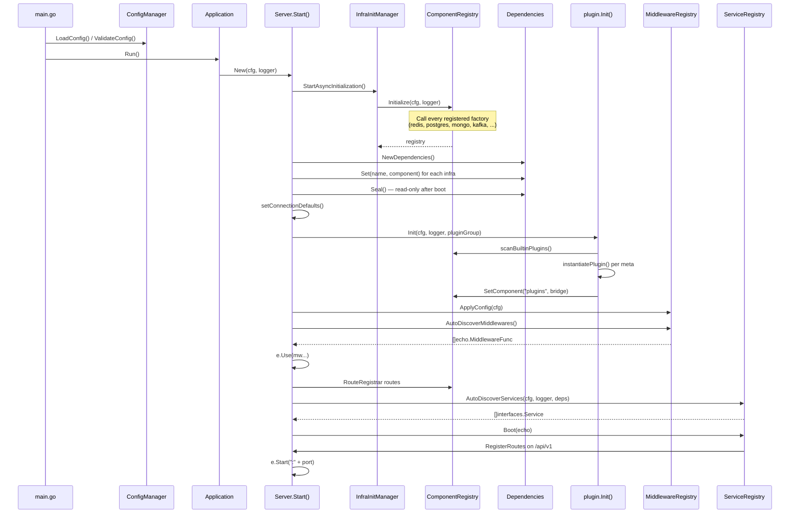
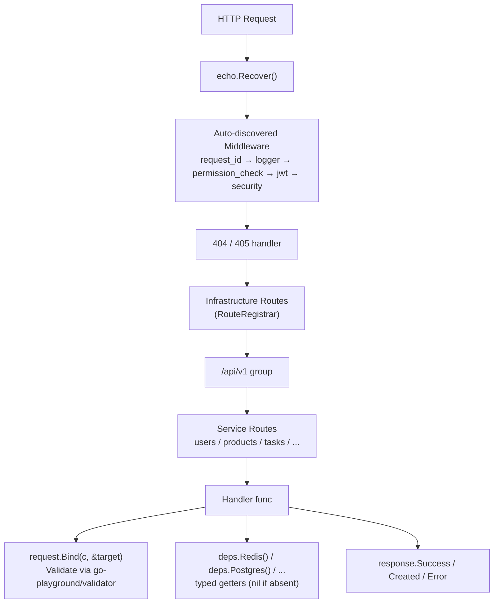
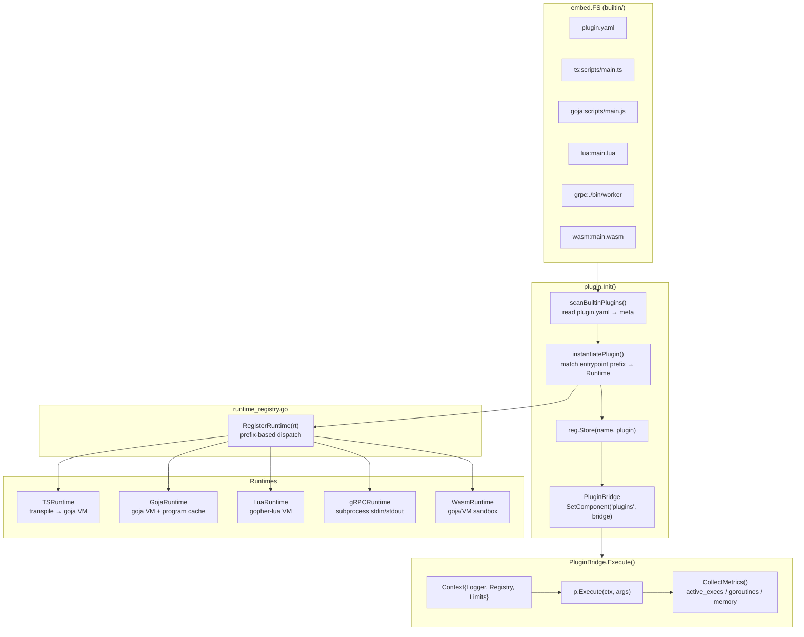
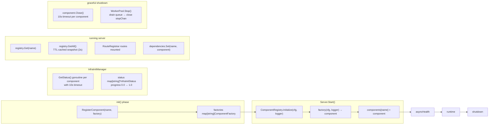
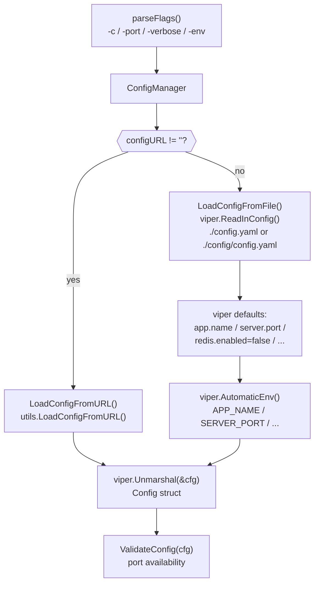
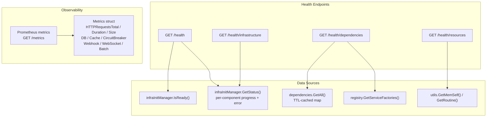

# stackyrd — Design & Architecture

## High-level architecture

## Boot sequence

## Extension points

```mermaid
flowchart LR
    subgraph Service["Service (internal/services/modules/)"]
        S1["interface<br/>Name / WireName / Enabled<br/>Endpoints / RegisterRoutes / Get"]
        S2["init() → RegisterService(name, factory)<br/>or RegisterServiceWithDeps(name, factory)"]
        S3["plain factory: cfg, logger → Service<br/>dep factory: cfg, logger, deps → Service"]
        S4["config.yaml: services.{wire_name}: true/false"]
    end

    subgraph Middleware["Middleware (internal/middleware/)"]
        M1["echo.MiddlewareFunc"]
        M2["init() → RegisterMiddleware(name, factory)"]
        M3["factory: cfg, logger → echo.MiddlewareFunc"]
        M4["config.yaml: middleware.{name}: true/false"]
    end

    subgraph Infra["Infrastructure (pkg/infrastructure/)"]
        I1["interface<br/>Name / Close / GetStatus"]
        I2["init() → RegisterComponent(name, factory)"]
        I3["factory: cfg, logger → InfrastructureComponent"]
        I4["Optional: RouteRegistrar<br/>RouteHandlers() []RouteHandler"]
        I5["config.yaml: {redis|postgres|mongo|...}.enabled"]
    end

    subgraph Plugin["Plugin (pkg/plugin/builtin/{name}/)"]
        P1["Plugin interface<br/>Execute(ctx, args) → Result"]
        P2["PluginMeta (plugin.yaml)<br/>name / version / entrypoint / limits"]
        P3["Runtime registry<br/>ts: / goja: / lua: / grpc: / wasm:"]
        P4["PluginBridge (infra component)"]
        P5["config.yaml: plugins.enabled / overrides / allowlist"]
    end

    S1 --- S2 --- S3 --- S4
    M1 --- M2 --- M3 --- M4
    I1 --- I2 --- I3 --- I4 --- I5
    P1 --- P2 --- P3 --- P4 --- P5
```

## Request lifecycle

## Plugin system architecture

## Infrastructure component lifecycle

## Dependency injection flow

```mermaid
flowchart LR
    subgraph InfraComponents["Infrastructure Components"]
        redis["redis.RedisManager"]
        pg["postgres.PostgresConnectionManager"]
        mongo["mongo.MongoConnectionManager"]
        kafka["kafka.KafkaManager"]
        grafana["grafana.GrafanaManager"]
        cron["cron.CronManager"]
        minio["minio.MinIOManager"]
        plugins["plugin.PluginBridge"]
    end

    subgraph DepsBag["Dependencies (sealed after boot)"]
        getters["typed getters:<br/>Redis() / Postgres() / Mongo()<br/>Kafka() / Grafana() / Cron() / MinIO()<br/>each returns *T or nil"]
        cache["GetAll() — TTL-cached snapshot (2s)"]
    end

    subgraph ServiceFactories["Service Factory (init)"]
        f1["RegisterService('users', factory)<br/>plain: cfg, logger → Service"]
        f2["RegisterServiceWithDeps('tasks', factory)<br/>deps: cfg, logger, deps → Service"]
    end

    subgraph AutoDiscover["AutoDiscoverServices()"]
        ad["for each plain factory:<br/>  svc = factory(cfg, logger)<br/>for each dep factory:<br/>  svc = factory(cfg, logger, deps)<br/>serviceDiscovered.Store(name, svc.Get())"]
    end

    InfraComponents --> DepsBag
    DepsBag --> ServiceFactories
    ServiceFactories --> AutoDiscover
```

## Config loading & validation

## Health & observability

