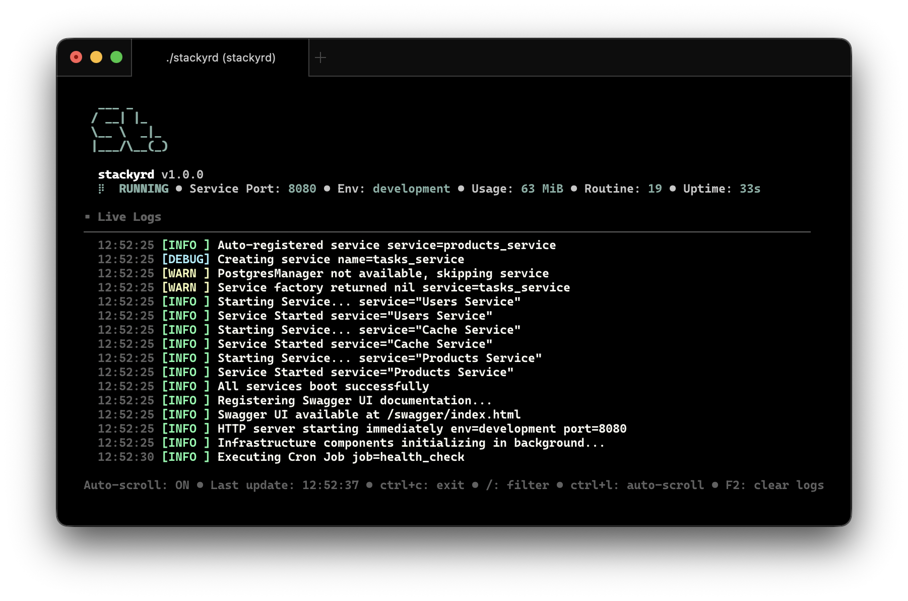

<div align="center">
  
</div>
<div align="center">
  
  
  
  
  
  
</div>
<br>

Stackyrd provides an enterprise-grade service fabric foundation for building robust and observable distributed systems in Go. Our goal is to bridge the gap between rapid development cycles and industrial-strength stability, making complex microservices architectures manageable from day one.

## Quick Start

### Installation & Run

```bash
# Clone the repository
git clone https://github.com/diameter-tscd/stackyrd.git
cd stackyrd

# Install dependencies
go mod download

# Run the application
go run cmd/app/main.go

# To build the application
go run scripts/build/build.go

```

## Preview



## Key Features

- **Modular Services**: Enable/disable services via configuration
- **Terminal UI**: Interactive boot sequence and live CLI dashboard
- **Infrastructure Support**: Redis, PostgreSQL (multi-tenant), Kafka, MinIO and many more at `stackyrd-pkg`
- **Security**: API encryption, authentication, and access controls
- **Build Tools**: Automated build scripts with backup and archiving with `build.go`

## Documentation

**[Full Documentation](docs_wiki/)** - Comprehensive guides and references

## License

Distributed under the Apache License Version 2.0. See `LICENSE` for full information.
