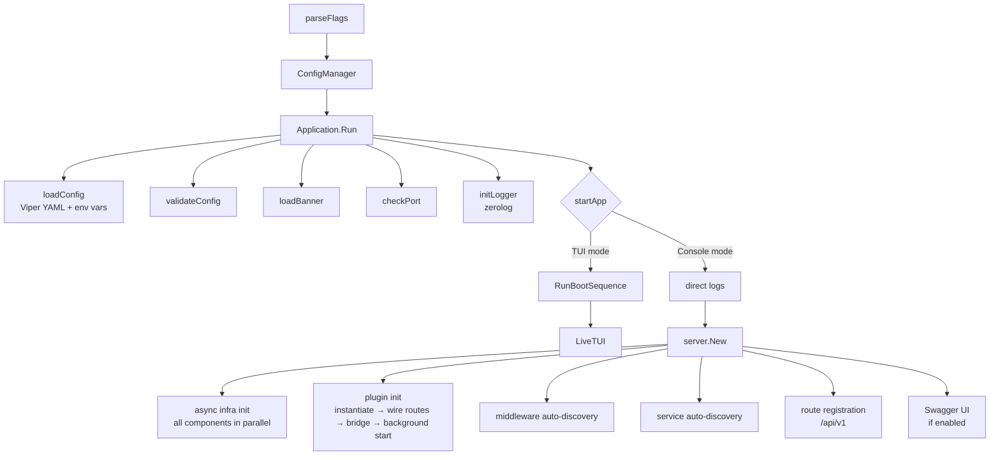
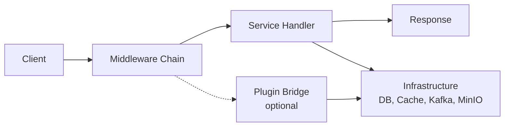
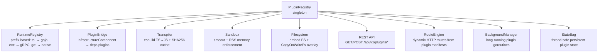

# Architecture Overview

**stackyrd** is an enterprise-grade modular Go framework built on **Gin** with auto-discovery patterns, async infrastructure initialization, a plugin system (TS/Go/Python/Lua), TUI dashboard, and Prometheus metrics.

## Key Concepts

### Auto-Discovery Pattern
Components register themselves via `init()` functions at import time:

- **Services**: Business logic in `internal/services/modules/`
- **Middleware**: HTTP middleware in `internal/middleware/`
- **Infrastructure**: Database/clients in `pkg/infrastructure/`
- **Plugins**: TypeScript/Go/Lua/Python scripts in `pkg/plugin/builtin/`

### Boot Sequence



### Request Flow



### TUI vs Console Mode
- Set `app.enable_tui: true` in config.yaml for bubbletea TUI (boot animation, live dashboard, log viewer, charts)
- Default (`false`) uses traditional console logging with banner

## Project Structure

```mermaid
flowchart TD
    A[stackyrd/]
    A --> B[cmd/app/<br/>Entry point, CLI, bootstrap]
    A --> C[config/<br/>Viper YAML config loading]
    A --> D[config.yaml]
    A --> E[internal/]
    E --> F[middleware/<br/>Auto-registered HTTP middleware]
    E --> G[server/<br/>Gin setup, health endpoints]
    A --> H[internal/services/modules/<br/>Auto-discovered business services]
    A --> I[pkg/]
    I --> J[assets/<br/>Embedded application assets (banner.txt)]
    I --> K[interfaces/<br/>Service interface]
    I --> L[plugin/<br/>Plugin system]
    L --> M[builtin/<br/>Plugin manifests]
    L --> N[sdk/<br/>TS type declarations]
    L --> O[python/<br/>Python host runtime]
    I --> P[registry/<br/>Service registry + DI]
    I --> Q[infrastructure/<br/>DB/clients async-managed]
    I --> R[response/<br/>API response helpers]
    I --> S[request/<br/>Binding + validation]
    I --> T[logger/<br/>Zerolog structured logger]
    I --> U[tui/<br/>Bubbletea terminal UI]
    I --> V[metrics/<br/>Prometheus metrics]
    I --> W[pagination/<br/>Cursor-based pagination]
    I --> X[batch/<br/>Batch processing]
    I --> Y[resilience/<br/>Circuit breaker, health, retry]
    I --> Z[webhook/<br/>Webhook handler]
    I --> AA[websocket/<br/>WebSocket handler]
    I --> AB[logging/<br/>Log rotation, sampling]
    I --> AC[testing/<br/>Test helpers + mocks]
    I --> AD[utils/<br/>General utilities]
    A --> AE[scripts/<br/>CLI tools]
    A --> AF[tests/<br/>Integration tests]
    A --> AG[docs/<br/>Auto-generated Swagger docs]
    A --> AH[docs_wiki/<br/>Hand-written documentation]
    A --> AI[deployments/kubernetes/<br/>K8s manifests]
    A --> AJ[.github/workflows/<br/>CI]
    A --> AK[docker-compose.yaml]
```

## Service Pattern
```go
type Service interface {
    Name() string
    WireName() string
    Enabled() bool
    Endpoints() []string
    RegisterRoutes(*gin.RouterGroup)
    Get() interface{}
}

// Auto-registration with dependency injection
func init() {
    registry.RegisterService("service_name", func(cfg *config.Config, log *logger.Logger, deps *registry.Dependencies) interfaces.Service {
        helper := registry.NewServiceHelper(cfg, log, deps)
        if !helper.IsServiceEnabled("service_name") {
            return nil
        }
        return NewService(true, log)
    })
}
```

## Infrastructure Component Pattern
```go
type InfrastructureComponent interface {
    Name() string
    Close() error
    GetStatus() map[string]interface{}
}

type ComponentFactory func(cfg *config.Config, logger *logger.Logger) (InfrastructureComponent, error)

// Auto-registration
func init() {
    infrastructure.RegisterComponent("redis", func(cfg *config.Config, log *logger.Logger) (infrastructure.InfrastructureComponent, error) {
        return NewRedisManager(cfg)
    })
}
```

Components are initialized **asynchronously** by `InfraInitManager` with per-component health polling.

## Plugin System



## Middleware Pattern
```go
type MiddlewareFactory func(cfg *config.Config, logger *logger.Logger) (gin.HandlerFunc, error)

func init() {
    middleware.RegisterMiddleware("cors", func(cfg *config.Config, logger *logger.Logger) (gin.HandlerFunc, error) {
        return corsMiddleware, nil
    })
}
```

## Key Features
- **Dependency Injection**: Dynamic `Dependencies` container with TTL-cached GetAll()
- **Async Initialization**: All infrastructure components init in parallel
- **Multi-connection DB**: Postgres + MongoDB with named connection managers
- **Plugin System**: TypeScript (goja), Python/external (gRPC), Lua, Go — with HTTP routes, WebSocket, persistent state, and background execution
- **TUI Dashboard**: Bubbletea boot sequence + live monitoring dashboard
- **Prometheus Metrics**: HTTP, DB, cache, circuit breaker, webhook, batch, WebSocket
- **Resilience**: Circuit breaker, retry with backoff, health checks, timeouts
- **Pagination**: Cursor-based with base64-encoded cursors
- **Scripts**: Build, Docker, code generation, Swagger, package management tools
