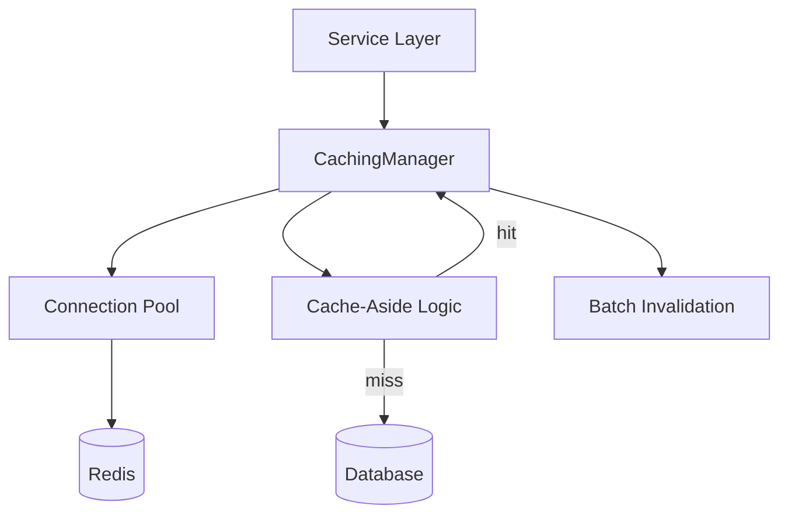

# Caching Guide

Redis-backed cache abstraction with TTL support, cache-aside pattern, and batch invalidation.

## Overview

The `pkg/cache/` package provides a `CachingManager` that wraps go-redis and implements standard caching patterns. It depends on the **redis** infrastructure component for the underlying connection pool and supports synchronous and asynchronous operations with configurable TTLs.

## Architecture



## CachingManager

The `CachingManager` is the primary entry point. It wraps go-redis and provides high-level cache operations.

### Creating a Manager

```go
import "stackyrd/pkg/cache"

// CachingManager wraps go-redis and uses the infrastructure RedisManager.
// Create via the factory with a config section.
manager := cache.NewManager(cfg.Caching, redisClient)
```

### Basic Operations

```go
// Set a value with TTL
err := manager.Set(ctx, "user:123", userData, 5*time.Minute)

// Get a value
val, err := manager.Get(ctx, "user:123")

// Delete a key
err := manager.Delete(ctx, "user:123")

// Check existence
exists, err := manager.Exists(ctx, "user:123")
```

### Typed Operations

```go
type User struct {
    ID   string `json:"id"`
    Name string `json:"name"`
}

// Set a typed value (auto-serialized)
err := manager.SetJSON(ctx, "user:123", User{ID: "123", Name: "Alice"}, 5*time.Minute)

// Get and deserialize
var user User
err := manager.GetJSON(ctx, "user:123", &user)
```

## Cache-Aside Pattern

The cache-aside (lazy loading) pattern is the recommended strategy for read-heavy workloads.

### Basic Cache-Aside

```go
func getUser(ctx context.Context, id string) (User, error) {
    var user User

    // Try cache first
    err := manager.GetJSON(ctx, "user:"+id, &user)
    if err == nil {
        return user, nil // cache hit
    }

    // Cache miss — load from database
    user, err = db.GetUser(ctx, id)
    if err != nil {
        return User{}, err
    }

    // Populate cache for next request
    if err := manager.SetJSON(ctx, "user:"+id, user, 5*time.Minute); err != nil {
        log.Warn().Err(err).Msg("failed to cache user")
    }

    return user, nil
}
```

### Cache-Aside with Fallback

```go
result, err := manager.GetOrFetch(ctx, "user:"+id, 5*time.Minute, func() (interface{}, error) {
    return db.GetUser(ctx, id)
})
```

## TTL Support

TTL is expressed as a `time.Duration`. A zero TTL means the key never expires.

### Per-Key TTL

```go
// Short-lived cache (30 seconds)
manager.Set(ctx, "rate:limit:usr_123", counter, 30*time.Second)

// Standard cache (5 minutes)
manager.Set(ctx, "session:tok_abc", sessionData, 5*time.Minute)

// Long-lived cache (24 hours)
manager.Set(ctx, "config:app", appConfig, 24*time.Hour)

// No expiry
manager.Set(ctx, "static:data", staticData, 0)
```

### TTL Inspection

```go
ttl, err := manager.TTL(ctx, "user:123")
// Returns the remaining time-to-live
```

### TTL Refresh

```go
// Extend TTL on cache hit (sliding expiration)
err := manager.Expire(ctx, "user:123", 5*time.Minute)
```

## Batch Invalidation

Invalidate multiple cache entries atomically.

### Deleting Multiple Keys

```go
keys := []string{"user:123", "user:456", "user:789"}
err := manager.DeleteBatch(ctx, keys)
```

### Pattern-Based Invalidation

```go
// Invalidate all keys matching a pattern
err := manager.InvalidatePattern(ctx, "user:*")

// Invalidate all keys in a namespace
err := manager.InvalidatePattern(ctx, "session:*")
```

### Tag-Based Invalidation

```go
// Tag a key on set
manager.SetWithTags(ctx, "article:42", content, 10*time.Minute, "articles", "featured")

// Invalidate all keys with a tag
manager.InvalidateByTag(ctx, "articles")
```

## Configuration

The `caching` section in `config.yaml` controls caching behavior:

```yaml
caching:
  enabled: true
  default_ttl: 5m          # Default TTL when none specified
  key_prefix: "stackyrd:"  # Prefix for all cache keys
  namespace: ""             # Optional isolation namespace
```

Config struct:

```go
type CachingConfig struct {
    Enabled     bool          `mapstructure:"enabled"`
    DefaultTTL  time.Duration `mapstructure:"default_ttl"`
    KeyPrefix   string        `mapstructure:"key_prefix"`
    Namespace   string        `mapstructure:"namespace"`
}
```

## Service Integration

### Using CachingManager in a Service

```go
type UserService struct {
    enabled bool
    logger  *logger.Logger
    cache   *cache.CachingManager
}

func (s *UserService) GetUser(c echo.Context) error {
    id := c.Param("id")

    var user User
    err := s.cache.GetJSON(c.Request.Context(), "user:"+id, &user)
    if err != nil {
        // Fetch from database on cache miss
        user = s.fetchFromDB(id)
        s.cache.SetJSON(c.Request.Context(), "user:"+id, user, 5*time.Minute)
    }

    return response.Success(c, user)
}
```

### Auto-Registration with Dependencies

The `CachingManager` is available via the `Dependencies` bag as `"caching"`:

```go
func init() {
    registry.RegisterService("users", func(cfg *config.Config, log *logger.Logger, deps *registry.Dependencies) interfaces.Service {
        var manager *cache.CachingManager
        if m, ok := deps.Get("caching"); ok {
            manager, _ = m.(*cache.CachingManager)
        }
        return NewUserService(cfg.Services.IsEnabled("users"), log, manager)
    })
}
```

## Best Practices

- **Always set a TTL** — avoid unbounded key growth; use `default_ttl` as a safety net
- **Use cache-aside** — lazy population is simpler and more resilient than write-through
- **Prefix keys** — use `key_prefix` to avoid collisions with other applications
- **Invalidate on writes** — clear cache entries when the underlying data changes
- **Pattern invalidation is expensive** — use `SCAN`-based patterns sparingly on large datasets
- **Monitor hit ratio** — low hit rates indicate TTLs are too short or data is not cacheable
- **Tag-based invalidation** — prefer tags over key enumeration for domain-level cache flushes
