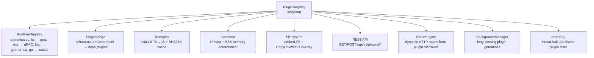
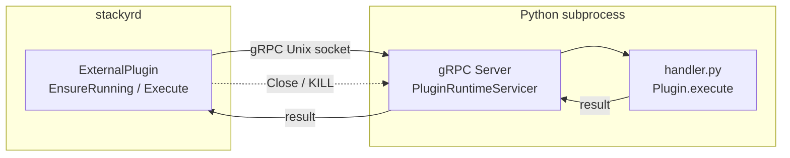

# Plugin System

Four plugin types (TypeScript, Lua, Python, Go) extend application logic at runtime via sandboxed VM execution, gRPC subprocesses, or native Go code.

## Overview

| Type | Entrypoint | Runtime | Language | Best for |
|------|------------|---------|----------|----------|
| **TypeScript** | `ts:scripts/handler.ts` | goja VM (in-process) | TypeScript | Dynamic logic, rapid iteration, safe sandbox |
| **Lua** | `lua:scripts/handler.lua` | gopher-lua VM (in-process) | Lua | Lightweight scripting, embedded sandbox, no deps |
| **Python** | `ext:scripts/handler.py` | gRPC subprocess | Python | Cross-language, existing Python code, ML/data |
| **Go** | `go:FuncName` | Native Go | Go | Maximum performance, direct infra access |

### Boot Order

Plugin initialization happens before service auto-discovery:

```
Infrastructure async init → populate Dependencies → PLUGIN INIT:
  1. Scan builtin plugins → register manifests + filesystems + stats
  2. Instantiate all plugins (CreatePlugin with route/background wrapping)
  3. Wire plugin HTTP routes + static files ← NEW
  4. Register PluginBridge as infra component
  5. Register management routes (/api/v1/plugins)
  6. Start background plugins ← NEW
→ Middleware → AutoDiscoverServices
```

### Architecture



## Quick Start

### Prerequisites

```bash
# Go
go 1.25.3+

# Python (for ext: plugins)
pip3 install grpcio protobuf

# Start stackyrd
go run cmd/app/main.go
```

### Verify plugins are loaded

```bash
curl -s http://localhost:8080/api/v1/plugins | jq
```

Expected output includes `inspector`, `aggregator`, `lua_demo`, `lua_transformer`, and `python_demo` (if Python deps are installed).

### Execute a plugin

```bash
curl -s -X POST http://localhost:8080/api/v1/plugins/inspector/execute \
  -H 'Content-Type: application/json' \
  -d '{"args": {"mode": "ping"}}' | jq
```

```bash
curl -s -X POST http://localhost:8080/api/v1/plugins/python_demo/execute \
  -H 'Content-Type: application/json' \
  -d '{"args": {"name": "developer"}}' | jq
```

```bash
curl -s -X POST http://localhost:8080/api/v1/plugins/lua_demo/execute \
  -H 'Content-Type: application/json' \
  -d '{"args": {"name": "Lua"}}' | jq
```

## TypeScript Plugins

TypeScript plugins run in-process in a sandboxed goja VM with access to infrastructure components via injected globals. No Go code is needed.

### How it works

1. Plugin is defined by a `plugin.yaml` manifest and `.ts` files in `scripts/`
2. At startup, the `.ts` is transpiled to JS via esbuild (SHA256-cached)
3. Each `Execute()` call creates a fresh goja VM with injected globals
4. The plugin calls `$done()` to return results

### Creating a TypeScript plugin

`pkg/plugin/builtin/my_plugin/plugin.yaml`:

```yaml
name: my_plugin
version: 1.0.0
description: My custom TypeScript plugin
author: you
entrypoint: "ts:scripts/handler.ts"
limits:
  max_timeout_ms: 5000
  max_memory_bytes: 26214400
```

`pkg/plugin/builtin/my_plugin/scripts/handler.ts`:

```typescript
function handler(): void {
    const input = $args.input || "default";
    $logger.info("Processing: " + input);

    const redisInfo = $infra.get("redis");
    if (redisInfo) {
        $logger.debug("Redis status: " + JSON.stringify(redisInfo.GetStatus()));
    }

    $done({
        success: true,
        data: {
            message: "Hello, " + input + "!",
            timestamp: new Date().toISOString(),
            limits: $limits,
        }
    });
}
handler();
```

### Injected globals

| Global | Type | Description |
|--------|------|-------------|
| `$args` | `Record<string, any>` | User-supplied execution arguments from the API call |
| `$logger` | `{ info, warn, error, debug }` | Scoped logger tagged with the plugin ID |
| `$limits` | `{ max_timeout_ms, max_memory_bytes }` | Effective resource limits for this execution |
| `$infra` | `{ get(name): Component }` | Access to infrastructure components |
| `$done` | `(result) => void` | Must be called to signal completion. Argument: `{ success, data?, error? }` |
| `$state` | `{ get, set, delete, clear, keys }` | Persistent state bag — values survive across executions |
| `$ws` | `{ send, close }` | WebSocket globals — only available in WS route handlers |
| `$background` | `{ sleep }` | Background execution — only in `background: true` plugins |

Type declarations are available at `pkg/plugin/sdk/plugin.d.ts`.

### Route Handlers

Plugins with `routes:` in their manifest register HTTP endpoints that call a named handler function. The request context is passed as `$args.request`.

```yaml
# plugin.yaml
routes:
  - path: /monitor/status
    method: GET
    handler: handleStatus
    public: true
  - path: /monitor/ws
    method: WS
    handler: handleWS
  - path: /monitor/ui/*filepath
    method: GET
    static_dir: dashboard
    static_index: index.html
```

```typescript
// Route handler — called on every HTTP request
function handleStatus() {
    const req = $args.request;
    $done({
        success: true,
        data: {
            method: req.method,
            path: req.path,
            query: req.query,
        }
    });
}
```

```typescript
// WebSocket handler — receives messages via $ws globals
function handleWS(data: any) {
    $logger.info("Received: " + JSON.stringify(data));
    $ws.send({ type: "pong", echo: data });
}
```

Static files are served from the plugin's `static_dir` directory, with writable overlay support (files can be uploaded at runtime via `PUT /api/v1/plugins/{name}/static/{file}`).

### Background Plugins

Plugins with `background: true` run a persistent goroutine at startup. The `$background.sleep()` global allows cooperative blocking that responds to shutdown signals.

```yaml
# plugin.yaml
name: monitor
background: true
```

```typescript
// Background plugin — runs in a dedicated goja VM
function main() {
    while (true) {
        const redis = $infra.get("redis");
        if (redis) {
            $state.set("last_status", redis.GetStatus());
        }
        $background.sleep(5000);
    }
}
main();
```

Background plugins are stopped cleanly on app shutdown via `PluginBridge.Close()` → `BackgroundManager.StopAll()`.

### Upload a new script at runtime

```bash
curl -s -X PUT http://localhost:8080/api/v1/plugins/my_plugin/scripts/handler.ts \
  -H 'Content-Type: application/json' \
  -d '{"content": "function handler() { $done({success: true, data: {msg: \"updated\"}}); } handler();"}' | jq
```

The script is written to the on-disk overlay (`store/plugins/my_plugin/scripts/handler.ts`), shadowing the embedded version.

### Limitations

- No `require()`, `import`, or `fetch()` — the goja VM is a pure ES2020 runtime
- No `setTimeout` or async operations — execute is synchronous
- Max resource usage is capped by `limits` in plugin.yaml
- WebSocket handlers run on the caller's goroutine; the VM is not goroutine-safe for concurrent use
- Background plugins use a dedicated VM; `$background.setInterval`/`setTimeout` are stubs — use `$background.sleep()` in a loop instead

## Lua Plugins

Lua plugins run in-process in a sandboxed gopher-lua VM (pure Go, no CGo). Ideal for lightweight scripting with infrastructure access and no subprocess overhead.

### How it works

1. Plugin is defined by a `plugin.yaml` manifest and `.lua` files in `scripts/`
2. Each `Execute()` call creates a fresh gopher-lua VM with injected globals
3. The plugin calls `done()` to return results
4. No transpilation step — Lua runs directly in the embedded VM

### Creating a Lua plugin

`pkg/plugin/builtin/my_lua_plugin/plugin.yaml`:

```yaml
name: my_lua_plugin
version: 1.0.0
description: My custom Lua plugin
author: you
entrypoint: "lua:scripts/handler.lua"
limits:
  max_timeout_ms: 10000
  max_memory_bytes: 33554432
```

`pkg/plugin/builtin/my_lua_plugin/scripts/handler.lua`:

```lua
function handle(args)
    local name = args["name"] or "world"
    logger:info("Processing request for " .. name)

    local redis = infra:get("redis")
    if redis then
        logger:debug("Redis status: " .. redis:GetStatus())
    end

    done({
        success = true,
        data = {
            message = "Hello, " .. name .. "!",
            plugin_name = plugin_name,
            limits = limits
        }
    })
end
```

### Injected globals

| Global | Type | Description |
|--------|------|-------------|
| `args` | `table` | User-supplied execution arguments from the API call |
| `logger` | `table` | Scoped logger with `info`, `warn`, `error`, `debug` methods |
| `limits` | `table` | Effective resource limits (`max_timeout_ms`, `max_memory_bytes`) |
| `infra` | `table` | Access to infrastructure components via `get(name)` |
| `done` | `function` | Must be called to signal completion. Argument: `{ success, data?, error? }` |
| `plugin_name` | `string` | Plugin name from manifest |

### Sandboxed environment

Lua plugins run in a restricted environment. Only safe libraries are loaded:

| Library | Functions |
|---------|-----------|
| `base` | `print`, `type`, `tostring`, `tonumber`, `ipairs`, `pairs`, `pcall`, `error`, `select` |
| `table` | `table.insert`, `table.remove`, `table.sort`, `table.concat` |
| `string` | `string.len`, `string.sub`, `string.gsub`, `string.match`, `string.upper`, `string.lower`, `string.format` |
| `math` | `math.abs`, `math.floor`, `math.ceil`, `math.min`, `math.max`, `math.sqrt`, `math.sin`, `math.random` |

Excluded for security: `io`, `os` (except `os.time`), `debug`, `loadfile`, `dofile`, `require` with file paths.

### Upload a new script at runtime

```bash
curl -s -X PUT http://localhost:8080/api/v1/plugins/my_lua_plugin/scripts/handler.lua \
  -H 'Content-Type: application/json' \
  -d '{"content": "function handle(args) done({success = true, data = {msg = \"updated\"}}) end"}' | jq
```

### Limitations

- No `require` with file paths — only sandboxed standard libraries are available
- No `io` or `os` library access (except `os.time`)
- No persistent state between calls — each call gets a fresh VM
- Max resource usage is capped by `limits` in plugin.yaml
- Lua numeric precision is limited to double (64-bit float)

## Python Plugins

Python plugins run as subprocesses communicating via gRPC over a Unix socket. Ideal for ML inference, data processing, or integrating Python libraries.

### Architecture



### Creating a Python plugin

`pkg/plugin/builtin/my_python_plugin/plugin.yaml`:

```yaml
name: my_python_plugin
version: 1.0.0
description: My Python plugin
author: you
entrypoint: "ext:scripts/handler.py"
limits:
  max_timeout_ms: 15000
  max_memory_bytes: 33554432
```

`pkg/plugin/builtin/my_python_plugin/scripts/handler.py`:

```python
from sdk import Plugin


class MyPlugin(Plugin):
    def execute(self, args):
        name = args.get("name", "world")
        return {
            "success": True,
            "data": {
                "message": f"Hello, {name}!",
                "source": "python-plugin",
            }
        }
```

The plugin class must:
- Inherit from `Plugin`
- Implement `execute(self, args: dict) -> dict`
- Return a dict with `success: bool`, optional `data`, optional `error`

### Python SDK

The SDK is at `pkg/plugin/python/sdk.py`:

```python
class Plugin:
    """Base class for all Python plugins."""

    def __init__(self):
        self.name = ""

    def configure(self, name: str):
        """Called before first execute with the plugin name."""
        self.name = name

    def execute(self, args: dict) -> dict:
        """Override this. Return {success, data?, error?}."""
        raise NotImplementedError
```

### Environment variables

- `PLUGIN_PYTHON_HOST` — override path to `host.py` (default: `pkg/plugin/python/host.py`)
- `PLUGIN_PYTHON_BIN` — override Python binary (default: `python3` from PATH)

### Lifecycle

- The Python subprocess starts on the first `Execute()` call
- It stays alive for subsequent calls (reuses the same gRPC connection)
- It is killed on `Close()` (when plugin is unloaded or app shuts down)
- If the subprocess crashes, the next call restarts it automatically

### Requirements

```bash
pip3 install grpcio protobuf
```

Generated gRPC stubs are at `pkg/plugin/python/plugin_pb2.py` and `pkg/plugin/python/plugin_pb2_grpc.py`. Regenerate if the proto changes:

```bash
python3 -m grpc_tools.protoc \
  -I. \
  --python_out=pkg/plugin/python \
  --grpc_python_out=pkg/plugin/python \
  pkg/plugin/plugin.proto

sed -i '' 's/from pkg.plugin import/import/' pkg/plugin/python/plugin_pb2_grpc.py
```

## Go Plugins

Go plugins compile into the stackyrd binary and run as native Go code with direct access to all infrastructure components and the full Go runtime.

### Creating a Go plugin

Place the `.go` file in `pkg/plugin/` (e.g., `pkg/plugin/plugin_myplugin.go`):

```go
package plugin

import (
    "fmt"
    "github.com/spf13/afero"
)

func init() {
    RegisterPlugin("myplugin", func(meta PluginMeta, fs afero.Fs) (Plugin, error) {
        return &MyPlugin{fs: fs, name: meta.Name}, nil
    })
}

type MyPlugin struct {
    fs   afero.Fs
    name string
}

func (p *MyPlugin) Meta() PluginMeta {
    return PluginMeta{Name: p.name}
}

func (p *MyPlugin) Execute(ctx Context, args map[string]interface{}) (*Result, error) {
    redis, ok := ctx.Registry.Get("redis")
    if ok {
        status := redis.GetStatus()
        _ = status
    }

    return &Result{
        Success: true,
        Data:    map[string]interface{}{"message": "hello from Go plugin"},
    }, nil
}

func (p *MyPlugin) Validate() error {
    if p.name == "" {
        return fmt.Errorf("name required")
    }
    return nil
}

func (p *MyPlugin) Close() error {
    return nil
}

var _ Plugin = (*MyPlugin)(nil)
```

`pkg/plugin/builtin/myplugin/plugin.yaml`:

```yaml
name: myplugin
version: 1.0.0
description: My Go plugin
author: you
entrypoint: "go:MyPlugin"
limits:
  max_timeout_ms: 5000
  max_memory_bytes: 52428800
```

The `.go` file must NOT be placed inside `builtin/` subdirectories — Go requires all files with the same `package` declaration to be in one directory. Place the `.go` file directly in `pkg/plugin/`.

## Management API

All endpoints are registered at `/api/v1/plugins`.

### List all plugins

```bash
curl -s http://localhost:8080/api/v1/plugins | jq
```

```json
{
  "plugins": [
    { "name": "inspector", "version": "1.0.0", "description": "...", "status": "loaded" },
    { "name": "aggregator", "version": "1.1.0", "description": "...", "status": "loaded" },
    { "name": "python_demo", "version": "1.0.0", "description": "...", "status": "loaded" }
  ]
}
```

### Get plugin detail

```bash
curl -s http://localhost:8080/api/v1/plugins/inspector | jq
```

```json
{
  "name": "inspector",
  "version": "1.0.0",
  "description": "Queries all active infrastructure components ...",
  "author": "stackyrd",
  "entrypoint": "ts:scripts/handler.ts",
  "type": "typescript",
  "depends_on": [],
  "limits": { "max_timeout_ms": 15000, "max_memory_bytes": 33554432 },
  "status": "loaded"
}
```

### Execute a plugin

```bash
curl -s -X POST http://localhost:8080/api/v1/plugins/inspector/execute \
  -H 'Content-Type: application/json' \
  -d '{"args": {"mode": "ping"}}' | jq
```

The `args` object is passed as `$args` (TypeScript), `args` (Lua), or the `args` parameter (Python/Go).

### Upload a script

```bash
curl -s -X PUT http://localhost:8080/api/v1/plugins/inspector/scripts/handler.ts \
  -H 'Content-Type: application/json' \
  -d '{"content": "function handler() { $done({success: true, data: {msg: \"hello\"}}); } handler();"}' | jq
```

The file is written to the on-disk overlay. Only applies to TS and Lua plugins.

### List scripts

```bash
curl -s http://localhost:8080/api/v1/plugins/inspector/scripts | jq
```

### Get script source

```bash
curl -s http://localhost:8080/api/v1/plugins/inspector/scripts/handler.ts | jq
```

### Unload a plugin

```bash
curl -s -X DELETE http://localhost:8080/api/v1/plugins/inspector | jq
```

The plugin is removed from the registry. Re-discovered on next app restart.

## Calling Plugins from Services

Services can call plugins via `PluginBridge`, which is available in the `Dependencies` bag as `"plugins"`.

### From a service

```go
registry.RegisterService("my_service", func(cfg *config.Config, logger *logger.Logger, deps *registry.Dependencies) interfaces.Service {
    var bridge *plugin.PluginBridge
    if b, ok := deps.Get("plugins"); ok {
        bridge, _ = b.(*plugin.PluginBridge)
    }
    return NewMyService(logger, bridge)
})

func (s *MyService) handleStatus(c *gin.Context) {
    if s.bridge != nil && s.bridge.HasPlugin("inspector") {
        result, err := s.bridge.Execute("inspector", map[string]interface{}{
            "mode": "ping",
        })
        if err != nil { /* handle */ }
    }
}
```

### From infrastructure components

```go
reg := infrastructure.GetGlobalRegistry()
if comp, ok := reg.Get("plugins"); ok {
    if bridge, ok := comp.(*plugin.PluginBridge); ok {
        plugins := bridge.ListPlugins()
        result, _ := bridge.Execute("aggregator", map[string]interface{}{
            "mode": "dashboard",
        })
        _ = result
    }
}
```

### Convenience accessor

```go
bridge := plugin.GetGlobalPluginBridge()
if bridge != nil && bridge.HasPlugin("inspector") {
    // ...
}
```

## Configuration

### config.yaml

```yaml
plugins:
  enabled: true
  default_limits:
    max_timeout_ms: 30000          # 30 seconds
    max_memory_bytes: 104857600    # 100 MB
  allowlist: []                    # empty = all plugins allowed
  background:                      # NEW — background plugin settings
    enabled: true
    max_plugins: 10
  overrides:
    inspector:
      max_timeout_ms: 10000
```

### Viper keys

| Key | Description |
|-----|-------------|
| `plugins.enabled` | Enable/disable the plugin system |
| `plugins.default_limits.max_timeout_ms` | Default timeout for all plugins |
| `plugins.default_limits.max_memory_bytes` | Default memory limit |
| `plugins.allowlist` | Restrict to specific plugins (empty = all allowed) |
| `plugins.background.enabled` | Enable/disable background plugin execution |
| `plugins.background.max_plugins` | Maximum concurrent background plugins |
| `plugins.overrides.{name}.max_timeout_ms` | Per-plugin timeout override |
| `plugins.overrides.{name}.max_memory_bytes` | Per-plugin memory override |

### Allowlist

When `allowlist` is non-empty, only plugin names in this list are registered at boot. Plugins not in the list are silently skipped. An empty list (or omitted) allows all built-in plugins.

```yaml
plugins:
  allowlist: ["inspector", "lua_demo", "lua_transformer"]
```

### Hard cap

The `default_limits` act as a hard cap — if a plugin's `plugin.yaml` or config `overrides` set limits higher than the defaults, they are clamped to the defaults.

## Filesystem & Overlays

Each plugin gets a layered filesystem:

```
Layer 1 (read-only base):  embed.FS (builtin/{name}/)
Layer 2 (writable overlay): os.DirFS(store/plugins/{name}/ on disk)
    → Combined via afero.NewCopyOnWriteFs
    → Files in store/{name}/ shadow builtin versions
    → PUT requests write to the overlay
```

Directory layout:

```
store/plugins/{name}/
    scripts/      — uploaded/replaced scripts
    static/       — uploadable static assets (served by route static_dir)
    .cache/       — TS transpilation cache (SHA256 keyed)
    config/       — reserved
    data/         — reserved
```

## Sandbox & Limits

### TypeScript (goja)

| Protection | Mechanism | Trigger |
|------------|-----------|---------|
| Timeout | `context.WithTimeout` | `limits.max_timeout_ms` |
| OOM | RSS polling every 500ms (gopsutil) | `limits.max_memory_bytes` |
| Panic | `recover()` in Execute wrapper | Any Go panic |

### Python (external)

| Protection | Mechanism |
|------------|-----------|
| Timeout | gRPC deadline propagation |
| Crash | Subprocess exit → auto-restart on next call |
| Resource | OS-level process isolation (separate address space) |

### Lua (gopher-lua)

| Protection | Mechanism | Trigger |
|------------|-----------|---------|
| Timeout | `context.WithTimeout` | `limits.max_timeout_ms` |
| OOM | RSS polling every 500ms (gopsutil) | `limits.max_memory_bytes` |
| Panic | `recover()` in Execute wrapper | Any Go panic |

### Go (native)

| Protection | Mechanism |
|------------|-----------|
| Timeout | Context cancellation |
| Panic | `recover()` |
| Memory | No automatic limit (native Go) |

## Built-in Plugins

### Inspector (`ts:scripts/handler.ts`)

Queries all infrastructure components and returns their status.

```bash
curl -s -X POST http://localhost:8080/api/v1/plugins/inspector/execute \
  -H 'Content-Type: application/json' \
  -d '{"args": {"mode": "status", "components": ["redis", "postgres"]}}' | jq
```

Modes: `status` (default), `ping`.

### Aggregator (`ts:scripts/handler.ts`)

Advanced diagnostics with dashboard, query, and transform modes.

```bash
curl -s -X POST http://localhost:8080/api/v1/plugins/aggregator/execute \
  -H 'Content-Type: application/json' \
  -d '{"args": {"mode": "dashboard"}}' | jq
```

```bash
curl -s -X POST http://localhost:8080/api/v1/plugins/aggregator/execute \
  -H 'Content-Type: application/json' \
  -d '{"args": {"mode": "transform", "input": {"name": "  hello  "}, "rules": [{"field": "name", "operation": "trim"}, {"field": "name", "operation": "uppercase"}]}}' | jq
```

```bash
curl -s -X POST http://localhost:8080/api/v1/plugins/aggregator/execute \
  -H 'Content-Type: application/json' \
  -d '{"args": {"mode": "query", "component": "redis", "command": "status"}}' | jq
```

### Python Demo (`ext:scripts/handler.py`)

Minimal Python plugin demonstrating the gRPC-based external runtime.

```bash
curl -s -X POST http://localhost:8080/api/v1/plugins/python_demo/execute \
  -H 'Content-Type: application/json' \
  -d '{"args": {"name": "developer"}}' | jq
```

### Lua Demo (`lua:scripts/handler.lua`)

Minimal Lua plugin demonstrating the basic `handle()` + `done()` pattern.

```bash
curl -s -X POST http://localhost:8080/api/v1/plugins/lua_demo/execute \
  -H 'Content-Type: application/json' \
  -d '{"args": {"name": "Lua"}}' | jq
```

### Lua Transformer (`lua:scripts/handler.lua`)

Multi-mode Lua data transformer with map, filter, sort, flatten, and format operations.

```bash
curl -s -X POST http://localhost:8080/api/v1/plugins/lua_transformer/execute \
  -H 'Content-Type: application/json' \
  -d '{"args": {"mode": "map", "data": {"name": "  Alice  ", "score": 95.678}, "mappings": [{"from": "name", "to": "name", "fn": "trim"}, {"from": "score", "to": "rounded_score", "fn": "round", "places": 1}]}}' | jq
```

## Best Practices

### General

- Keep plugins stateless for on-demand execution — each `Execute()` should be self-contained. Use Redis or Postgres for persistence.
- For stateful workflows, use `$state` — values persist across `Execute()` calls for the same plugin.
- Handle infrastructure availability — components may not be ready. Check for nil and set `available: false` gracefully.
- Set appropriate limits — match `max_timeout_ms` and `max_memory_bytes` to the plugin's workload.
- Use the overlay for iterative development — upload scripts via the API instead of rebuilding the binary.

### TypeScript

- Cache expensive data in variables — the goja VM is fresh per call, but `$infra.get()` can fetch cached data from Redis.
- Keep handlers small — decompose complex logic into helper functions in the same file.
- Log liberally — `$logger.info/debug/warn/error` is forwarded to the structured logger.

### Python

- Install dependencies in the same Python environment — `host.py` runs with the system `python3`.
- Handle imports inside `execute()` — lazy imports avoid loading modules at startup if they are not needed.
- Watch for GIL-bound workloads — Python's GIL means CPU-heavy work blocks the gRPC server. Use multiprocessing for CPU-bound tasks.

### Lua

- Keep handlers simple — decompose complex logic into helper functions within the same file.
- Use logger methods — `logger:info/debug/warn/error` is forwarded to the structured logger.
- Watch for numeric precision — Lua uses double-precision floats.
- Sanitize string concatenation — use `..` operator carefully with nil values (use `tostring()` when needed).

### Go

- Use the factory pattern — register via `init()` with `RegisterPlugin` to keep auto-discovery working.
- Avoid blocking `Execute()` — do not call `Close()` from within `Execute()` (deadlock risk).

## Limitations

| Limitation | Detail |
|------------|--------|
| No hot-reload | Plugins are loaded at startup. Unload is manual via DELETE API. Re-init requires restart. |
| TS: No external imports | goja does not support `require` or ES module imports. All logic must be in the handler file. |
| TS: No async | `$done()` must be called synchronously. No `Promise`, `setTimeout`, or `fetch`. |
| TS: WS single-goroutine | WebSocket handlers run on the caller's goroutine. goja is not goroutine-safe — never call `$ws.*` concurrently. |
| TS: Background sleep only | `$background` only provides `sleep()` for cooperative blocking. `setInterval`/`setTimeout` are stubs. |
| Lua: No file I/O | `io`, `os` (except `os.time`), `loadfile`, `dofile`, and `require` with file paths are disabled for security. |
| Lua: Numeric precision | Lua uses double-precision floats; integers above 2^53 may lose precision. |
| Python: Subprocess latency | First call starts the Python host (~200ms). Subsequent calls are fast (reused connection). |
| Python: gRPC dependency | Python plugins require `grpcio` and `protobuf` installed on the host. |
| Go: Same process | Go plugins run in the same address space as stackyrd. A buggy Go plugin can crash the app. |
| No persistent plugin storage | Each plugin has a `data/` directory in the overlay, but it is not a database. |
| No plugin-to-plugin calls | Plugins can only call infrastructure components, not other plugins. |

## Troubleshooting

### Plugin not appearing in the list

```bash
curl -s http://localhost:8080/api/v1/plugins | jq
```

Check:
- Is `plugins.enabled: true` in `config.yaml`?
- Does the plugin directory exist under `pkg/plugin/builtin/{name}/`?
- Does `plugin.yaml` have correct YAML syntax?
- Does the server log show errors? `plugin.Init()` logs registration failures.

### TypeScript plugin execution fails

Common causes:
- Syntax error in `.ts` file (check esbuild transpilation in logs)
- `$done()` not called (plugin hangs until timeout)
- `$done()` called with wrong argument format (use `{success, data?, error?}`)
- Resource limit exceeded (check `max_timeout_ms` and `max_memory_bytes`)

### Python plugin execution fails

```bash
{"success":false,"error":"failed to start plugin host: ..."}
```

Check:
- `python3` is available: `which python3`
- `grpcio` and `protobuf` installed: `pip3 list | grep -E "grpc|protobuf"`
- Script path exists and is valid Python
- Socket path is writable (`/tmp/`)

### Lua plugin execution fails

Common causes:
- Syntax error in `.lua` file (check for missing `end`, incorrect operators)
- `done()` not called (plugin hangs until timeout)
- `done()` called with wrong argument format (use `{success = true, data = ..., error = ...}`)
- Attempting to use a blocked library (`io.*`, `os.*` except `os.time`)
- Resource limit exceeded (check `max_timeout_ms` and `max_memory_bytes`)

### Plugin takes too long

- Increase `limits.max_timeout_ms` in `plugin.yaml` or via config override
- Check if the plugin is making slow infrastructure calls
- For Python: ensure the gRPC server is responding (the host stays alive between calls)
