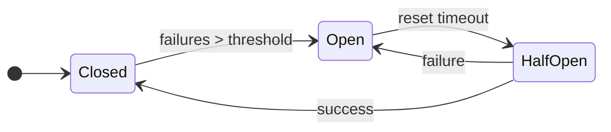

# Resilience Patterns

Circuit breakers, health checks, retry with backoff, and timeout enforcement for building fault-tolerant services.

## Circuit Breaker

The circuit breaker prevents cascading failures by stopping requests to a failing service.

### State Machine



### Basic Usage

```go
import "stackyrd/pkg/resilience"

// Simple circuit breaker
cb := resilience.NewCircuitBreaker(
    resilience.DefaultCircuitBreakerConfig("payment-service"),
)

err := cb.Execute(func() error {
    return callPaymentAPI()
})
```

### Custom Configuration

```go
cb := resilience.NewCircuitBreaker(resilience.CircuitBreakerConfig{
    Name:                "database",
    MaxFailures:         3,
    ResetTimeout:        60 * time.Second,
    HalfOpenMaxRequests: 2,
    OnStateChange: func(name string, from, to resilience.State) {
        log.Printf("breaker %s: %s → %s", name, from, to)
    },
})
```

### Fallback on Open

```go
result, err := cb.ExecuteWithFallback(
    func() error { return callPrimary() },
    func() error {
        // fallback logic when circuit is open
        return callCache()
    },
)
```

### Manual State Management

```go
if cb.AllowRequest() {
    err := doWork()
    if err != nil {
        cb.RecordFailure()
    } else {
        cb.RecordSuccess()
    }
}
```

### Stats & Monitoring

```go
stats := cb.GetStats()
// Returns: name, state, failure_count, success_count, last_failure, last_success
```

### Circuit Breaker Manager

For multiple named breakers:

```go
mgr := resilience.NewCircuitBreakerManager()

cb := mgr.GetOrCreate(
    resilience.DefaultCircuitBreakerConfig("service-a"),
)
cb2 := mgr.GetOrCreate(
    resilience.DefaultCircuitBreakerConfig("service-b"),
)

// Inspect all breakers
for name, breaker := range mgr.GetAll() {
    fmt.Printf("%s: %s\n", name, breaker.GetState())
}
```

## Retry with Backoff

Retry transient failures with exponential backoff and jitter.

### Basic Retry

```go
err := resilience.Retry(func() error {
    return flakyNetworkCall()
})
// Default: 3 attempts, 100ms initial, 2.0 factor, jitter
```

### Custom Configuration

```go
err := resilience.Retry(func() error {
    return flakyOp()
}, resilience.RetryConfig{
    MaxAttempts:  5,
    InitialDelay: 200 * time.Millisecond,
    MaxDelay:     5 * time.Second,
    BackoffFactor: 2.0,
    Jitter:       true,
})
```

### Context-Aware Retry

```go
ctx, cancel := context.WithTimeout(context.Background(), 30*time.Second)
defer cancel()

err := resilience.RetryWithContext(ctx, func() error {
    return dbQuery()
})
```

### Retry with Result

```go
result, err := resilience.RetryWithResult(func() (User, error) {
    return fetchUser(id)
})
```

### Selective Retry

Only retry specific error types:

```go
err := resilience.Retry(func() error {
    result, err := doSomething()
    if errors.Is(err, ErrRateLimited) {
        return resilience.NewRetryableError(err)
    }
    return err
}, resilience.RetryConfig{
    RetryIf: resilience.RetryIfRetryable(),
})
```

## Health Checks

Concurrent health-check execution with critical/non-critical distinction.

### Registering Checks

```go
hc := resilience.NewHealthChecker()

// Simple check
hc.RegisterSimpleCheck("database", func() error {
    return db.Ping()
})

// Detailed check with timeout
hc.RegisterCheck(&resilience.HealthCheck{
    Name:    "redis",
    Check:   func(ctx context.Context) error { return redis.Ping(ctx) },
    Timeout: 5 * time.Second,
    Critical: true,
})
```

### Running Checks

```go
report := hc.Check(context.Background())
// report.Status: "healthy" | "degraded" | "unhealthy"
// report.Checks: map[string]*HealthResult

for name, result := range report.Checks {
    fmt.Printf("%s: %s (%v)\n", name, result.Status, result.Duration)
}
```

### Quick Checks

```go
if hc.IsHealthy(ctx) {
    // all checks pass
}

if hc.IsCriticalHealthy(ctx) {
    // only critical checks matter
}
```

### Integration with Health Endpoints

stackyrd exposes health endpoints at runtime:

| Endpoint | Description |
|----------|-------------|
| `GET /health` | Overall status (server + infra + init progress) |
| `GET /health/infrastructure` | Per-component infrastructure status |
| `GET /health/dependencies` | Registered components + service factories |
| `GET /health/resources` | Memory usage + goroutine count |

## Timeout Enforcement

Execute functions with deadline guarantees.

### Basic Timeout

```go
err := resilience.WithTimeout(func() error {
    return slowOperation()
}, 5*time.Second)
// Returns resilience.ErrTimeout if exceeded
```

### Timeout with Result

```go
result, err := resilience.WithTimeoutResult(func() ([]byte, error) {
    return http.Get(url)
}, 10*time.Second)
```

### Context-Based Timeout

```go
// Use parent context with deadline
ctx, cancel := context.WithTimeout(parentCtx, 5*time.Second)
defer cancel()

err := resilience.WithContext(ctx, func() error {
    return doWork(ctx)
})
```

### Timeout Config

```go
err := resilience.WithTimeoutConfig(
    doWork,
    resilience.TimeoutConfig{Timeout: 3 * time.Second},
)
```

## Combining Patterns

### Circuit Breaker + Retry + Timeout

```go
func resilientCall(ctx context.Context) error {
    cb := resilience.NewCircuitBreaker(
        resilience.DefaultCircuitBreakerConfig("external-api"),
    )

    return cb.Execute(func() error {
        return resilience.RetryWithContext(ctx, func() error {
            return resilience.WithTimeout(func() error {
                return callExternalAPI()
            }, 5*time.Second)
        }, resilience.RetryConfig{
            MaxAttempts:  3,
            InitialDelay: 100 * time.Millisecond,
            Jitter:       true,
        })
    })
}
```

### Health Check + Circuit Breaker Integration

```go
// Register circuit breaker stats as health checks
hc.RegisterSimpleCheck("payment-circuit-breaker", func() error {
    cb := breakerMgr.Get("payment-service")
    if cb == nil {
        return fmt.Errorf("not found")
    }
    if cb.GetState() == resilience.StateOpen {
        return fmt.Errorf("circuit is OPEN")
    }
    return nil
})
```

## Best Practices

- **Set MaxFailures conservatively** — 3-5 failures before opening avoids flap
- **Use jitter** — prevents thundering herd on retry
- **Circuit breaker + retry** — let the breaker trip before retries exhaust
- **Timeouts are mandatory** — always set a timeout for external calls
- **Health check timeouts** — should be shorter than the operation timeout
- **Critical vs non-critical** — mark database/queue checks as critical; cache checks as non-critical
