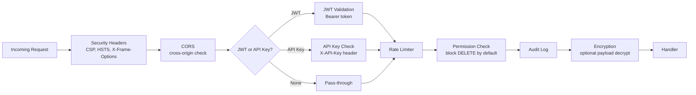

# Security Guide

Security configuration, middleware, and best practices for stackyrd.

## Security Middleware

Enable/disable in `config.yaml` under `middleware:`.



### Security Headers

Adds HTTP security headers to all responses:

```yaml
middleware:
  security: true
```

Headers set:
- `X-Content-Type-Options: nosniff`
- `X-Frame-Options: DENY`
- `X-XSS-Protection: 1; mode=block`
- `Strict-Transport-Security: max-age=31536000; includeSubDomains`
- `Content-Security-Policy: default-src 'self'`
- `Referrer-Policy: strict-origin-when-cross-origin`
- `Permissions-Policy: geolocation=(self), microphone=()`

### CORS

```yaml
middleware:
  cors: true
```

Configure allowed origins in application config. By default allows all origins in development.

### JWT Authentication

```yaml
middleware:
  jwt: false

auth:
  type: jwt
  secret: "your-secret-key"
```

JWT middleware validates `Authorization: Bearer <token>` headers. Uses `golang-jwt/jwt/v5`.

### API Key Authentication

```yaml
auth:
  type: apikey
```

Validates API key from `X-API-Key` header or `api_key` query parameter.

### Rate Limiting

```yaml
middleware:
  ratelimit: true
```

Prevents abuse by limiting requests per client. Configuration is middleware-internal.

### Permission Check

```yaml
middleware:
  permission_check: true
```

Blocks `DELETE` requests by default as a safety measure. Can be extended for role-based access control.

### Encryption Middleware

```yaml
middleware:
  encryption: false
```

For request/response payload encryption between trusted services.

## Authentication Modes

Configured via `auth.type`:

| Mode | Description | Use Case |
|------|-------------|----------|
| `none` | No authentication | Development, internal-only |
| `apikey` | Static API key | Service-to-service auth |
| `jwt` | JSON Web Tokens | User-facing APIs |

## Secrets Management

### Never Hardcode Secrets

```yaml
# BAD: secrets in config.yaml
auth:
  secret: "my-super-secret-key"

# GOOD: environment variable overrides
auth:
  secret: "${AUTH_SECRET}"
```

Use environment variables to override config values:

```bash
export AUTH_SECRET="your-secret-key"
export JWT_SECRET="another-secret-key"
export POSTGRES_PASSWORD="db-password"
```

### Encryption Config

```yaml
encryption:
  enabled: true
  algorithm: aes-256-gcm
  key: "${ENCRYPTION_KEY}"  # 32-byte hex-encoded key
  rotate_keys: false
  key_rotation_interval: "24h"
```

## CORS Configuration

By default, CORS is permissive for development. For production:

```yaml
middleware:
  cors: true

# CORS configuration is managed within the middleware factory
```

## Input Validation

Use the `pkg/request` package for request binding and validation:

```go
type CreateUserRequest struct {
    Username string `json:"username" validate:"required,min=3,max=20"`
    Email    string `json:"email" validate:"required,email"`
    Password string `json:"password" validate:"required,min=8"`
}

func (s *UserService) create(c *gin.Context) {
    var req CreateUserRequest
    if err := request.Bind(c, &req); err != nil {
        if validationErr, ok := err.(*request.ValidationError); ok {
            response.ValidationError(c, "Validation failed", validationErr.GetFieldErrors())
            return
        }
        response.BadRequest(c, err.Error())
        return
    }
    // safe to use req
}
```

## Plugin System Security

### Sandbox Protections

| Plugin Type | Protection |
|-------------|------------|
| TypeScript | goja sandbox (no require, no imports, no fetch) |
| Lua | Restricted libraries (no io, os, debug) |
| Python | OS-level process isolation |
| Go | Same process (trusted only) |

### Plugin Limits

```yaml
plugins:
  default_limits:
    max_timeout_ms: 30000      # 30 second timeout
    max_memory_bytes: 104857600 # 100 MB memory cap
  allowlist: ["inspector"]     # restrict to specific plugins
```

- `default_limits` act as a hard cap (plugin manifests cannot exceed)
- `allowlist` restricts which plugins load at startup
- External (Python) plugins run as separate processes

## Production Checklist

- [ ] Set `auth.type` to `jwt` or `apikey` (not `none`)
- [ ] Enable `security` middleware for HTTP headers
- [ ] Enable `ratelimit` middleware for abuse protection
- [ ] Set `encryption` key via environment variable
- [ ] Use secrets from environment variables, not config.yaml
- [ ] Set CORS to specific origins (not `*`)
- [ ] Enable `permission_check` middleware
- [ ] Enable `audit` middleware for request logging
- [ ] Set restrictive plugin `allowlist`
- [ ] Use HTTPS in production (reverse proxy or TLS)
- [ ] Run as non-root user in Docker
