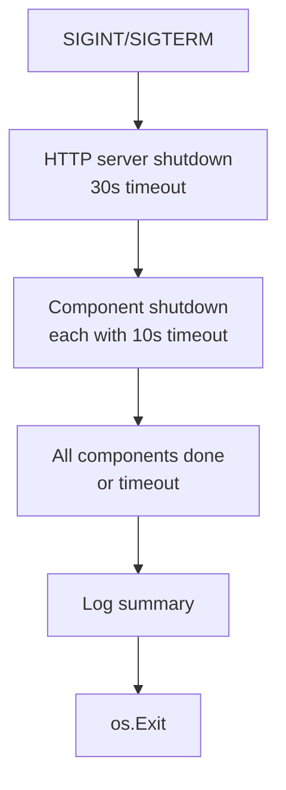

# Shutdown Guide

Graceful shutdown behavior, guarantees, and best practices.

## Overview

When the application receives `SIGINT` or `SIGTERM`, it initiates a graceful shutdown sequence. The process is designed to drain in-flight requests and close infrastructure components cleanly before exiting.

## Shutdown Sequence



### Step 1: HTTP Server Draining

The HTTP server begins draining in-flight requests with a **30-second hard timeout** (`internal/server/server.go:230`):

```go
shutdownCtx, cancel := context.WithTimeout(ctx, 30*time.Second)
s.httpSrv.Shutdown(shutdownCtx)
```

- New requests are rejected immediately
- Existing requests get up to 30s to complete
- After 30s, remaining connections are force-closed

### Step 2: Component Shutdown

All registered infrastructure components and dependencies are shut down **concurrently and unordered** (`internal/server/server.go:244-273`):

```go
for name, component := range s.dependencies.GetAll() {
    shutdownComponent(name, component)
}
```

Each component gets its own goroutine with a **10-second timeout**:

- Components with a `Close() error` method are eligible for shutdown
- If `Close()` completes within 10s, shutdown continues normally
- If `Close()` times out, a warning is logged and shutdown proceeds
- Errors are collected and summarized at the end

## Guarantees

| Property | Guarantee |
|----------|-----------|
| **Ordering** | None. Components shut down concurrently with no dependency ordering |
| **Per-component timeout** | 10 seconds |
| **HTTP drain timeout** | 30 seconds |
| **Total wall time** | Unbounded — N components × 10s max in worst case |
| **Error accumulation** | All Close() errors are collected and reported |
| **Process exit** | `os.Exit(0)` after shutdown + 2s delay (`cmd/app/application.go:256,270`) |

## Best Practices

### For Component Authors

1. **`Close()` should respect context cancellation** — If your component holds a context, select on `ctx.Done()` in your Close method.

2. **`Close()` should be idempotent** — May be called multiple times in edge cases.

3. **Keep `Close()` fast** — Network disconnects, flush operations, etc. should use a context with timeout internally. Don't rely solely on the 10s outer timeout.

4. **Log meaningful errors** — Return descriptive errors from `Close()` so the shutdown summary is actionable.

### For Service Authors

- **Don't assume ordering** — Component A may close before component B even if A depends on B
- **Use health checks** — After shutdown begins, services should treat closed dependencies as degraded rather than crashing
- **Graceful degradation** — Handle nil/closed dependency references in your handler paths

## Limitations

- **No reverse-topological ordering** — Dependencies are iterated in map iteration order (random). A component may find its dependency already closed.
- **Components not implementing `Close()` are skipped** — They are not notified of shutdown at all.
- **Plugin system shutdown** — Background plugins are stopped before component shutdown via `stopBackgroundPlugins()` in `pkg/plugin/init.go:422`.
