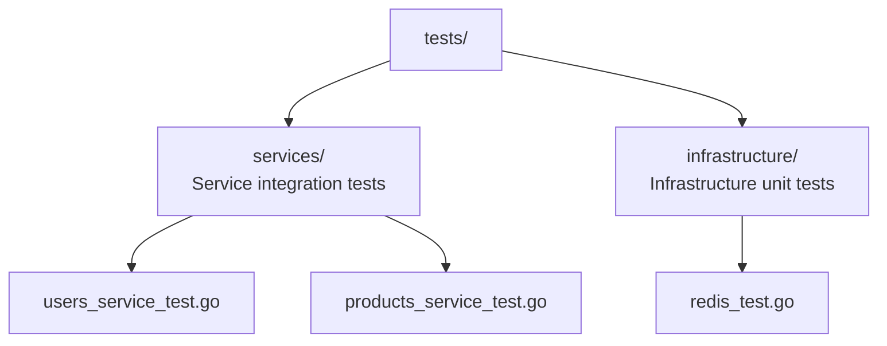

# Testing Guide

Testing strategy for stackyrd: unit tests, integration tests, mocking, and test helpers.

## Test Structure



Tests mirror source structure under a flat `tests/` directory.

## Test Helpers

`pkg/testing/helpers.go` provides utilities for writing HTTP handler tests:

```go
import "stackyrd/pkg/testing"

// Create a test Gin context + response recorder
c, w := testing.NewTestContext("GET", "/api/v1/users", nil)

// Assert HTTP status
testing.AssertStatus(t, w, 200)

// Assert JSON response body
testing.AssertJSON(t, w, map[string]interface{}{"success": true})

// Parse response into struct
var resp testing.TestResponse
testing.ParseResponse(w, &resp)
```

## Writing Service Tests

### Basic Handler Test

```go
func TestListUsers(t *testing.T) {
    svc := NewUsersService(true, logger)
    c, w := testing.NewTestContext("GET", "/api/v1/users", nil)

    svc.handleList(c)
    testing.AssertStatus(t, w, 200)

    var resp testing.TestResponse
    testing.ParseResponse(w, &resp)
    assert.True(t, resp.Success)
}
```

### Testing with Request Body

```go
func TestCreateUser(t *testing.T) {
    body := map[string]interface{}{
        "username": "jdoe",
        "email":    "jdoe@example.com",
    }
    c, w := testing.NewTestContext("POST", "/api/v1/users", body)

    svc := NewUsersService(true, logger)
    svc.handleCreate(c)

    testing.AssertStatus(t, w, 201)
}
```

### Testing with Query Parameters

```go
func TestListUsersPagination(t *testing.T) {
    c, w := testing.NewTestContext("GET", "/api/v1/users?page=1&limit=10", nil)
    // handler reads from c.Request.URL.Query()
    svc.handleList(c)
    testing.AssertStatus(t, w, 200)
}
```

## Writing Middleware Tests

```go
func TestCORSMiddleware(t *testing.T) {
    gin.SetMode(gin.TestMode)
    r := gin.New()
    r.Use(corsMiddleware)
    r.GET("/test", func(c *gin.Context) { c.Status(200) })

    req, _ := http.NewRequest("OPTIONS", "/test", nil)
    req.Header.Set("Origin", "http://example.com")
    w := httptest.NewRecorder()
    r.ServeHTTP(w, req)

    assert.Equal(t, "http://example.com", w.Header().Get("Access-Control-Allow-Origin"))
}
```

## Writing Infrastructure Tests

```go
func TestRedisConnection(t *testing.T) {
    if testing.Short() {
        t.Skip("skipping integration test")
    }

    cfg := &config.Config{}
    viper.Set("redis.enabled", true)
    viper.Set("redis.address", "localhost:6379")

    mgr, err := NewRedisManager(cfg)
    require.NoError(t, err)
    defer mgr.Close()

    status := mgr.GetStatus()
    assert.True(t, status["connected"].(bool))
}
```

## Mocking Dependencies

For service tests that depend on infrastructure, use the `testify/mock` pattern:

```go
type MockRedisManager struct {
    mock.Mock
}

func (m *MockRedisManager) Name() string {
    return "redis"
}

func (m *MockRedisManager) Get(key string) (string, error) {
    args := m.Called(key)
    return args.String(0), args.Error(1)
}

func TestServiceWithRedis(t *testing.T) {
    mockRedis := new(MockRedisManager)
    mockRedis.On("Get", "user:123").Return("{\"name\":\"Alice\"}", nil)

    svc := NewMyService(true, logger, mockRedis)
    // test handler
    mockRedis.AssertExpectations(t)
}
```

## Running Tests

```bash
# Run all tests
go test ./...

# Verbose output
go test -v ./tests/...

# Run tests for specific package
go test -v ./pkg/resilience/

# Run tests with coverage
go test -coverprofile=coverage.out ./...
go tool cover -html=coverage.out

# Skip integration tests
go test -short ./...

# Run specific test
go test -v -run TestCreateUser ./tests/services/
```

## Test Patterns

### Table-Driven Tests

```go
func TestValidateEmail(t *testing.T) {
    tests := []struct {
        name    string
        email   string
        wantErr bool
    }{
        {"valid email", "user@example.com", false},
        {"missing @", "userexample.com", true},
        {"empty", "", true},
        {"valid subdomain", "user@sub.example.com", false},
    }

    for _, tt := range tests {
        t.Run(tt.name, func(t *testing.T) {
            err := validateEmail(tt.email)
            if tt.wantErr {
                assert.Error(t, err)
            } else {
                assert.NoError(t, err)
            }
        })
    }
}
```

### Subtests for Handler Patterns

```go
func TestUserHandlers(t *testing.T) {
    svc := NewUsersService(true, logger)

    t.Run("list", func(t *testing.T) {
        c, w := testing.NewTestContext("GET", "/api/v1/users", nil)
        svc.handleList(c)
        testing.AssertStatus(t, w, 200)
    })

    t.Run("get by id", func(t *testing.T) {
        c, w := testing.NewTestContext("GET", "/api/v1/users/1", nil)
        c.Params = []gin.Param{{Key: "id", Value: "1"}}
        svc.handleGet(c)
        testing.AssertStatus(t, w, 200)
    })

    t.Run("not found", func(t *testing.T) {
        c, w := testing.NewTestContext("GET", "/api/v1/users/999", nil)
        c.Params = []gin.Param{{Key: "id", Value: "999"}}
        svc.handleGet(c)
        testing.AssertStatus(t, w, 404)
    })
}
```

### Integration Test with Dependencies

```go
func TestServiceWithDependencies(t *testing.T) {
    if testing.Short() {
        t.Skip("skipping integration test")
    }

    deps := registry.NewDependencies()
    deps.Set("redis", testRedisManager)
    deps.Set("postgres", testPostgresManager)

    cfg := config.LoadConfig()
    logger := logger.NewLogger(cfg)

    svc := NewMyService(true, logger, deps)
    c, w := testing.NewTestContext("GET", "/api/v1/my-endpoint", nil)
    svc.RegisterRoutes(gin.New().Group("/api/v1"))

    // Verify routes are registered
    assert.NotEmpty(t, svc.Endpoints())
}
```

## CI Pipeline

The `.github/workflows/go-build.yml` pipeline runs:

```yaml
- name: Run tests
  run: go test -v ./...
```

For more details, see the CI workflow files in `.github/workflows/`.
