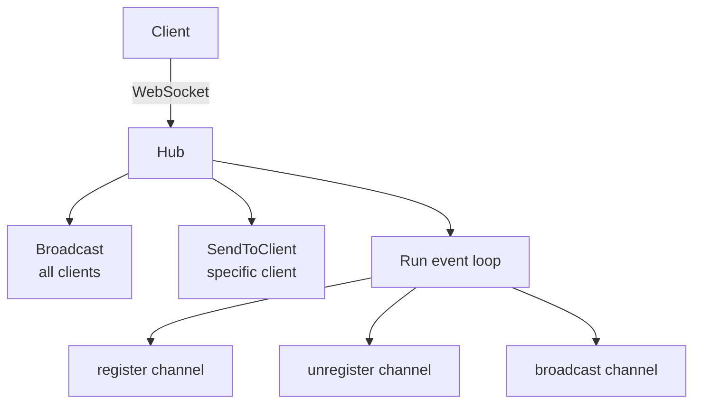
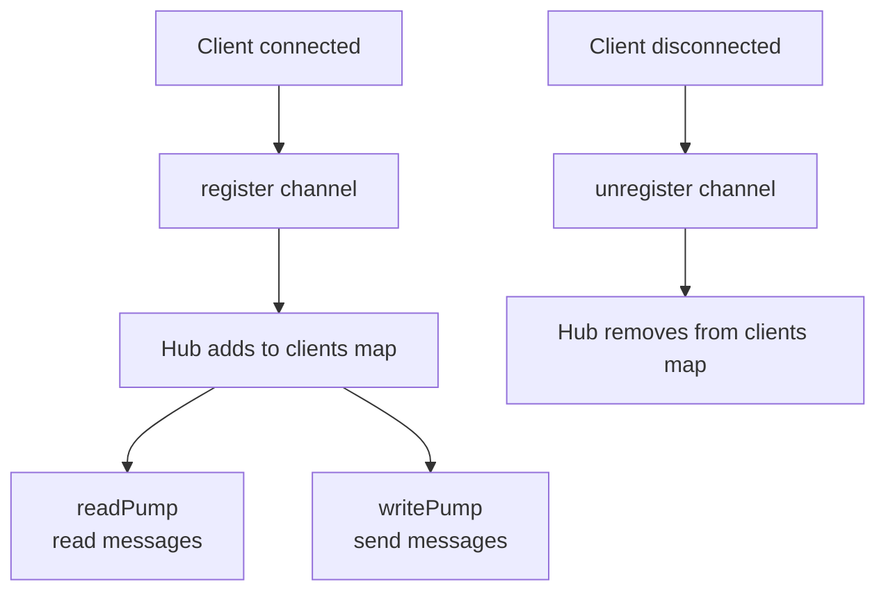

# WebSocket Guide

Real-time bidirectional communication via WebSocket connections.

## Overview

The WebSocket handler in `pkg/websocket/` provides a hub-based connection manager supporting broadcast, client-specific messaging, and room-based communication.

## Architecture



## Basic Usage

### Starting the Hub

```go
import "stackyrd-nano/pkg/websocket"

hub := websocket.NewHub()
go hub.Run() // event loop (blocking)
```

### Registering the WebSocket Endpoint

```go
engine := gin.Default()
engine.GET("/ws", websocket.HandleWebSocket(hub))
```

### Broadcasting Messages

```go
// Broadcast raw bytes
hub.Broadcast([]byte(`{"type":"event","data":"hello"}`))

// Broadcast typed message (auto-marshaled)
websocket.BroadcastMessage(hub, "user.created", map[string]interface{}{
    "id":   "usr_123",
    "name": "Alice",
})
```

### Sending to a Specific Client

```go
hub.SendToClient("client-abc-123", []byte(`{"type":"private"}`))
```

## Hub API

```go
type Hub struct {
    clients    map[*Client]bool
    clientsByID map[string]*Client
    broadcast   chan []byte
    register    chan *Client
    unregister  chan *Client
    mu          sync.RWMutex
}

// Start the event loop
func (h *Hub) Run()

// Broadcast raw message to all clients
func (h *Hub) Broadcast(message []byte)

// Send raw message to a specific client by ID
func (h *Hub) SendToClient(clientID string, message []byte)

// Get count of connected clients
func (h *Hub) GetConnectedClients() int
```

## Message Format

```go
type Message struct {
    Type    string      `json:"type"`
    Payload interface{} `json:"payload,omitempty"`
    Room    string      `json:"room,omitempty"`
}
```

### Using Message Struct

```go
msg := websocket.Message{
    Type:    "order.update",
    Payload: orderData,
}
data, _ := json.Marshal(msg)
hub.Broadcast(data)
```

## Client Lifecycle

Each WebSocket connection creates a `Client` with read/write pump goroutines:



## Monitoring

```go
stats := websocket.GetHubStats(hub)
// Returns: {"connected_clients": 5}
```

## Integration with Services

### Broadcasting from a Service

```go
type BroadcastService struct {
    enabled bool
    logger  *logger.Logger
    hub     *websocket.Hub
}

func (s *BroadcastService) handleEvent(c *gin.Context) {
    var event Event
    if err := c.ShouldBindJSON(&event); err != nil {
        response.BadRequest(c, err.Error())
        return
    }

    // Broadcast to all connected WebSocket clients
    websocket.BroadcastMessage(s.hub, event.Type, event.Data)
    response.Success(c, map[string]string{"status": "broadcasted"})
}
```

### WebSocket Service Pattern

```go
// In RegisterRoutes:
func (s *WebSocketService) RegisterRoutes(g *gin.RouterGroup) {
    g.GET("/ws", websocket.HandleWebSocket(s.hub))
    g.POST("/ws/broadcast", s.handleBroadcast)
}
```

## Connection Management

- **Client ID**: Query parameter `client_id` or client IP as fallback
- **Read pump**: Goroutine reading messages from the WS connection
- **Write pump**: Goroutine draining buffered messages to the WS connection
- **Cleanup**: Deferred `Close()` on both read and write pumps
- **Concurrency**: Hub channels are unbuffered; `Run()` is the single-event loop

## Best Practices

- Run `hub.Run()` in a dedicated goroutine at startup
- Use `BroadcastMessage()` instead of `Broadcast()` for structured data
- Keep message payloads small (< 1MB recommended)
- Handle client disconnection gracefully (clients register/unregister automatically)
- Do not block in message handlers — use goroutines for heavy processing
